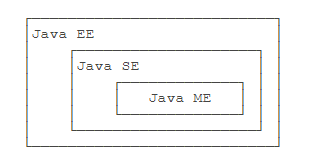

## Java简介

### Java语言的诞生

Java 是由 Sun Microsystems 公司于 1995 年 5 月推出的 Java 面向对象程序设计语言和 Java 平台的总称。由 James Gosling（Javaz之父）和同事们共同研发，并在 1995 年正式推出。

后来 Sun 公司被 Oracle （甲骨文）公司收购，Java 也随之成为 Oracle 公司的产品。

### Java的三个体系

- JavaSE（J2SE）（Java2 Platform Standard Edition，java平台标准版）

- JavaEE(J2EE)(Java 2 Platform,Enterprise Edition，java平台企业版)

- JavaME(J2ME)(Java 2 Platform Micro Edition，java平台微型版)。

  

  

2005 年 6 月，JavaOne 大会召开，SUN 公司公开 Java SE 6。此时，Java 的各种版本已经更名，以取消其中的数字 "2"：

- J2EE 更名为 Java EE
- J2SE 更名为Java SE，
- J2ME 更名为 Java ME。

 

1. Java SE就是标准版，包含标准的JVM和标准库
2. Java EE是企业版，它只是在Java SE的基础上加上了大量的API和库，以便方便开发Web应用、数据库、消息服务等，Java EE的应用使用的虚拟机和Java SE完全相同。
3. Java ME就和Java SE不同，它是一个针对嵌入式设备的“瘦身版”，Java SE的标准库无法在Java ME上使用，Java ME的虚拟机也是“瘦身版”。业界以Android开发成为了移动平台的标准之一，Java ME的使用相当少，不建议学习

::: tip 学习指南

1. 首先要学习Java SE，掌握Java语言本身、Java核心开发技术以及Java标准库的使用；
2. 如果继续学习Java EE，那么Spring框架、数据库开发、分布式架构就是需要学习的；
3. 如果要学习大数据开发，那么Hadoop、Spark、Flink这些大数据平台就是需要学习的，他们都基于Java或Scala开发；
4. 如果想要学习移动开发，那么就深入Android平台，掌握Android App开发。

Java SE是整个Java平台的核心，要成为真正的Java程序猿需要学习更多Java底层原理，精通Java SE

:::

