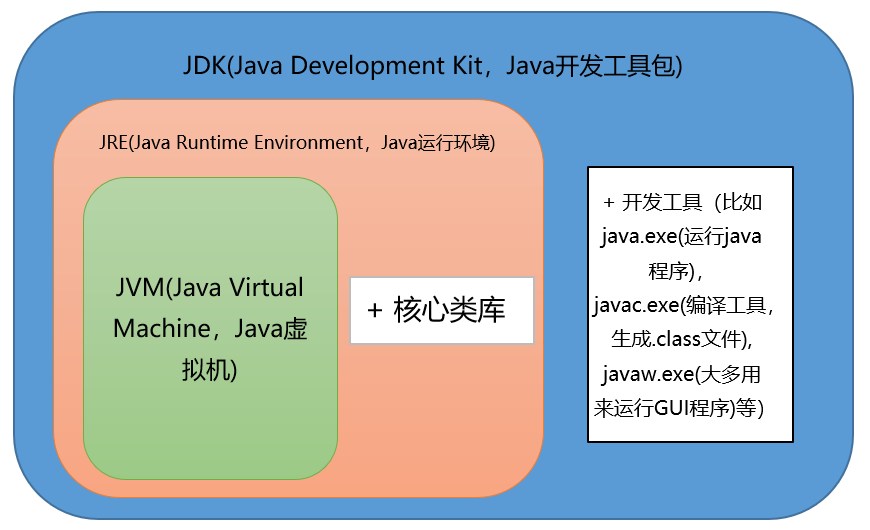

## 问题：

### 一、Java概述

1、何为编程

2、什么是Java

3、jdk1.5之后的三大版本

4、JVM、JRE和JDK的关系

5、什么是跨平台性？原理是什么

6、Java语言有哪些特点？

7、什么是字节码？采用字节码的最大好处是什么

8、什么是Java程序的主类？应用程序和小程序的主类有何不同？

9、Java应用程序与小程序之间有那些差别？

10、Java和C++的区别

11、Oracle JDK 和 OpenJDK 的对比

### 二、基础语法

#### （一）数据类型

1、Java有哪些数据类型

2、switch 是否能作用在 byte 上，是否能作用在 long 上，是否能作用在 String 上

3、用最有效率的方法计算 2 乘以 8

4、Math.round(11.5) 等于多少？Math.round(-11.5)等于多少

5、float f=3.4;是否正确

6、short s1 = 1; s1 = s1 + 1;有错吗?short s1 = 1; s1 += 1;有错吗

#### （二）编码

1、Java语言采用何种编码方案？有何特点？

#### （三）注释

1、什么Java注释

#### （四）访问修饰符

1、访问修饰符 public,private,protected,以及不写（默认）时的区别

#### （五）运算符

1、&和&&的区别

#### （六）关键字

1、Java 有没有 goto

2、final 有什么用？

3、final finally finalize区别

4、this关键字的用法

5、super关键字的用法

6、this与super的区别

7、static存在的主要意义

8、static的独特之处

9、static应用场景

10、static注意事项

#### （七）流程控制

1、break ,continue ,return 的区别及作用

2、在 Java 中，如何跳出当前的多重嵌套循环

### 三、面向对象

#### （一）面向对象概述

1、面向对象和面向过程的区别

#### （二）面向对象三大特性

2、面向对象的特征有哪些方面

3、什么是多态机制？Java语言是如何实现多态的？

4、面向对象七大基本原则是什么？

#### （三）类与接口

1、抽象类和接口的对比

2、普通类和抽象类有哪些区别？

3、抽象类能使用 final 修饰吗？

4、创建一个对象用什么关键字？对象实例与对象引用有何不同？

#### （四）变量与方法

1、成员变量与局部变量的区别有哪些？

2、在Java中定义一个不做事且没有参数的构造方法的作用

3、在调用子类构造方法之前会先调用父类没有参数的构造方法，其目的是？

4、一个类的构造方法的作用是什么？若一个类没有声明构造方法，该程序能正确执行吗？为什么？

5、构造方法有哪些特点？

6、静态变量和实例变量区别

7、静态变量与普通变量区别

8、静态方法和实例方法有何不同？

9、在一个静态方法内调用一个非静态成员为什么是非法的？

10、什么是方法的返回值？返回值的作用是什么？

#### （五）内部类

1、什么是内部类？

2、内部类的分类有哪些？

3、内部类的优点

4、内部类有哪些应用场景

5、局部内部类和匿名内部类访问局部变量的时候，为什么变量必须要加上final？

6、内部类相关，看程序说出运行结果

#### （六）重写与重载

1、构造器（constructor）是否可被重写（override）

2、重载（Overload）和重写（Override）的区别。重载的方法能否根据返回类型进行区分？

#### （七）对象相等判断

1、== 和 equals 的区别是什么

2、hashCode与 equals 方法 (==重要==)

4、对象的相等与指向他们的引用相等，两者有什么不同？

#### （八）值传递

1、当一个对象被当作参数传递到一个方法后，此方法可改变这个对象的属性，并可返回变化后的结果，那么这里到底是值传递还是引用传递

2、Java 中对象作为形参为什么还是值传递

3、值传递和引用传递有什么区别

#### （九）Java包

1、JDK 中常用的包有哪些

2、import java和javax有什么区别

### 四、常用API

#### （一）String相关

1、字符型常量和字符串常量的区别

2、什么是字符串常量池？

3、String 是最基本的数据类型吗

4、String有哪些特性

5、String为什么是不可变的吗？

6、String真的是不可变的吗？

7、是否可以继承 String 类

8、String str="i"与 String str=new String("i")一样吗？

9、String s = new String("xyz");创建了几个字符串对象

10、如何将字符串反转？

11、数组有没有 length()方法？String 有没有 length()方法

12、String 类的常用方法都有那些？

13、在使用 HashMap 的时候，用 String 做 key 有什么好处？

14、String和StringBuffer、StringBuilder的区别是什么？String为什么是不可变的

#### （二）Date相关


#### （三）包装类相关

1、自动装箱与拆箱

2、int 和 Integer 有什么区别

3、Integer a= 127 与 Integer b = 127相等吗


## 参考答案：

### 一、Java概述

> 1、何为编程

编程就是让计算机为解决某个问题而使用某种程序设计语言编写程序代码，并最终得到结果的过程。为了使计算机能够理解人的意图，

人类就必须要将需解决的问题的思路、方法、和手段通过计算机能够理解的形式告诉计算机，使得计算机能够根据人的指令一步一步去

工作，完成某种特定的任务。这种人和计算机之间交流的过程就是编程。


> 2、什么是Java

Java是一门面向对象编程语言，不仅吸收了C++语言的各种优点，还摒弃了C++里难以理解的多继承、指针等概念，因此Java语言具有功

能强大和简单易用两个特征。Java语言作为静态面向对象编程语言的代表，极好地实现了面向对象理论，允许程序员以优雅的思维方式

进行复杂的编程 。


> 3、jdk1.5之后的三大版本

1. **Java SE**（J2SE，Java 2 Platform Standard Edition，标准版）
   Java SE 以前称为 J2SE。它允许开发和部署在桌面、服务器、嵌入式环境和实时环境中使用的 Java 应用程序。Java SE 包含了支持 Java Web 服务开发的类，并为Java EE和Java ME提供基础。
2. **Java EE**（J2EE，Java 2 Platform Enterprise Edition，企业版）
   Java EE 以前称为 J2EE。企业版本帮助开发和部署可移植、健壮、可伸缩且安全的服务器端Java 应用程序。Java EE 是在 Java SE 的基础上构建的，它提供 Web 服务、组件模型、管理和通信 API，可以用来实现企业级的面向服务体系结构（service-oriented architecture，SOA）和 Web2.0应用程序。2018年2月，Eclipse 宣布正式将 JavaEE 更名为 JakartaEE
3. **Java ME**（J2ME，Java 2 Platform Micro Edition，微型版）
   Java ME 以前称为 J2ME。Java ME 为在移动设备和嵌入式设备（比如手机、PDA、电视机顶盒和打印机）上运行的应用程序提供一个健壮且灵活的环境。Java ME 包括灵活的用户界面、健壮的安全模型、许多内置的网络协议以及对可以动态下载的连网和离线应用程序的丰富支持。基于 Java ME 规范的应用程序只需编写一次，就可以用于许多设备，而且可以利用每个设备的本机功能。


> 4、JVM、JRE和JDK的关系

**JVM:**

- Java Virtual Machine是Java虚拟机，Java程序需要运行在虚拟机上
- 不同的平台有自己的虚拟机，因此Java语言可以实现跨平台。

**JRE:**

- Java Runtime Environment包括Java虚拟机和Java程序所需的核心类库等。
- 核心类库主要是java.lang包：包含了运行Java程序必不可少的系统类，如基本数据类型、基本数学函数、字符串处理、线程、异常处理类等，系统缺省加载这个包
- 如果想要运行一个开发好的Java程序，计算机中只需要安装JRE即可。

**JDK：**

- Java Development Kit是提供给Java开发人员使用的
- JDK包含了Java的开发工具，也包括了JRE。所以安装了JDK，就无需再单独安装JRE了。
- JDK的开发工具：编译工具(javac.exe)，打包工具(jar.exe)等

JVM&JRE&JDK关系图



> 5、什么是跨平台性？原理是什么

所谓跨平台性，是指java语言编写的程序，一次编译后，可以在多个系统平台上运行。

实现原理：Java程序是通过java虚拟机在系统平台上运行的，只要该系统可以安装相应的java虚拟机，该系统就可以运行java程序。


> 6、Java语言有哪些特点

简单易学（Java语言的语法与C语言和C++语言很接近）

面向对象（封装，继承，多态）

平台无关性（Java虚拟机实现平台无关性）

支持网络编程并且很方便（Java语言诞生本身就是为简化网络编程设计的）

支持多线程（多线程机制使应用程序在同一时间并行执行多项任）

健壮性（Java语言的强类型机制、异常处理、垃圾的自动收集等）

安全性


> 7、什么是字节码？采用字节码的最大好处是什么

**字节码**：

Java源代码经过虚拟机编译器编译后产生的文件（即扩展为 ==.class的文件== ），它不面向任何特定的处理器，只面向虚拟机。

**采用字节码的好处：**

Java语言通过字节码的方式，在一定程度上 ==解决了传统解释型语言执行效率低的问题，同时又保留了解释型语言可移植的特点。== 所以Java程序运行时比较高效，而且，由于字节码并不专对一种特定的机器，因此，Java程序无须重新编译便可在多种不同的计算机上运行。

先看下java中的编译器和解释器：

```java
Java源代码---->编译器---->jvm可执行的Java字节码(即虚拟指令)---->jvm---->jvm中解释器----->机器可执行的二进制机器码---->程序运行。

```

1. Java中引入了虚拟机的概念，即在机器和编译程序之间加入了一层抽象的虚拟机器。

2. 这台虚拟的机器在任何平台上都提供给编译程序一个共同的接口。

3. 编译程序只需要面向虚拟机，生成虚拟机能够理解的代码，然后由解释器来将虚拟机代码转换为特定系统的机器码执行。

4. 在Java中，这种供虚拟机理解的代码叫做字节码（即扩展为.class的文件），它不面向任何特定的处理器，只面向虚拟机。

5. 每一种平台的解释器是不同的，但是实现的虚拟机是相同的。

6. Java源程序经过编译器编译后变成字节码，字节码由虚拟机解释执行，虚拟机将每一条要执行的字节码送给解释器，解释器将其翻译成特定机器上的机器码，然后在特定的机器上运行，这就是上面提到的**Java的特点的编译与解释并存**的解释。

   

> 8、什么是Java程序的主类？应用程序和小程序的主类有何不同？

1. 一个程序中可以有多个类，但只能有一个类是主类。

2. 在Java应用程序中，这个主类是指包含main()方法的类。

3. 而在Java小程序中，这个主类是一个继承自系统类JApplet或Applet的子类。

4. 应用程序的主类不一定要求是public类，但小程序的主类要求必须是public类。主类是Java程序执行的入口点。

   

> 9、Java应用程序与小程序之间有那些差别？

1. 简单说应用程序是从主线程启动(也就是main()方法)。

2. applet小程序没有main方法，主要是嵌在浏览器页面上运行(调用init()线程或者run()来启动)，嵌入浏览器这点跟flash的小游戏类似

   

> 10、Java和C++的区别

- 都是面向对象的语言，都支持封装、继承和多态
- Java不提供指针来直接访问内存，程序内存更加安全
- Java的类是单继承的，C++支持多重继承；虽然Java的类不可以多继承，但是接口可以多继承。
- Java有自动内存管理机制，不需要程序员手动释放无用内存


> 11、Oracle JDK 和 OpenJDK 的对比

1. Oracle JDK版本将每三年发布一次，而OpenJDK版本每三个月发布一次；

2. OpenJDK 是一个参考模型并且是完全开源的，而Oracle JDK是OpenJDK的一个实现，并不是完全开源的；

3. Oracle JDK 比 OpenJDK 更稳定。OpenJDK和Oracle JDK的代码几乎相同，但Oracle JDK有更多的类和一些错误修复。因此，如果您想开发企业/商业软件，我建议您选择Oracle JDK，因为它经过了彻底的测试和稳定。某些情况下，有些人提到在使用OpenJDK 可能会遇到了许多应用程序崩溃的问题，但是，只需切换到Oracle JDK就可以解决问题；

4. 在响应性和JVM性能方面，Oracle JDK与OpenJDK相比提供了更好的性能；

5. Oracle JDK不会为即将发布的版本提供长期支持，用户每次都必须通过更新到最新版本获得支持来获取最新版本；

6. Oracle JDK根据**二进制代码许可协议**获得许可，而OpenJDK根据**GPL v2许可**获得许可。


### 二、基础语法

#### （一）数据类型

定义：Java语言是强类型语言，对于每一种数据都定义了明确的具体的数据类型，在内存中分配了不同大小的内存空间。

**分类：**

**（1）基本数据类型：**

1. 数值型
   - 整数类型(byte,short,int,long)
   - 浮点类型(float,double)
2. 字符型(char)
3. 布尔型(boolean)

**（2）引用数据类型：**

1. 类(class)
2. 接口(interface)
3. 数组([])

> 1、Java有哪些数据类型


> 2、switch 是否能作用在 byte 上，是否能作用在 long 上，是否能作用在 String 上

1. 在 Java 5 以前，switch(expr)中，expr 只能是 byte、short、char、int。
2. 从 Java5 开始，Java 中引入了枚举类型，expr 也可以是 enum 类型，
3. 从 Java 7 开始，expr 还可以是字符串（String），但是长整型（long）在目前所有的版本中都是不可以的。
4. 

> 3、用最有效率的方法计算 2 乘以 8

`2 << 3`（左移 3 位相当于乘以 2 的 3 次方，右移 3 位相当于除以 2 的 3 次方）。


> 4、Math.round(11.5) 等于多少？Math.round(-11.5)等于多少

Math.round(11.5)的返回值是 12，Math.round(-11.5)的返回值是-11。

四舍五入的原理是在参数上加 0.5 然后进行下取整。


> 5、float f=3.4;是否正确

不正确。

3.4 是双精度数，将双精度型（double）赋值给浮点型（float）属于下转型（down-casting，也称为窄化）会造成精度损失。

因此需要强制类型转换float f =(float)3.4; 或者写成 float f =3.4F;。


> 6、short s1 = 1; s1 = s1 + 1;有错吗?short s1 = 1; s1 += 1;有错吗

对于 short s1 = 1; s1 = s1 + 1;由于 1 是 int 类型，因此 s1+1 运算结果也是 int型，需要强制转换类型才能赋值给 short 型。

而 short s1 = 1; s1 += 1;可以正确编译，因为 s1+= 1;相当于 s1 = (short(s1 + 1);其中有隐含的强制类型转换。


#### （二）编码

> 1、Java语言采用何种编码方案？有何特点？

Java语言采用Unicode编码标准

Unicode（标准码），它为每个字符制订了一个唯一的数值，因此在任何的语言，平台，程序都可以放心的使用。

#### （三）注释

> 1、什么Java注释

定义：用于解释说明程序的文字

Java的三种注释：

- 单行注释: // 注释文字
- 多行注释: /* 注释文字 */
- 文档注释：/** 注释文字 */


**作用**：在程序中，尤其是复杂的程序中，适当地加入注释可以 ==增加程序的可读性，有利于程序的修改、调试和交流== 

注释的内容在程序编译的时候会被忽视，不会产生目标代码，注释的部分不会对程序的执行结果产生任何影响。

**注意事项**：多行和文档注释都不能嵌套使用。


#### （四）访问修饰符

> 1、访问修饰符 public,private,protected,以及不写（默认）时的区别

**定义**：Java中，可以使用访问修饰符来保护对类、变量、方法和构造方法的访问。

​			 Java 支持 4 种不同的访问权限，为实现封装性提供了条件。

**分类：**

private : 在同一类内可见。使用对象：变量、方法。 注意：不能修饰类（外部类）

default (即缺省，什么也不写，不使用任何关键字）: 在同一包内可见，不使用任何修饰符。使用对象：类、接口、变量、方法。

protected : 对同一包内的类和所有子类可见。使用对象：变量、方法。 注意：不能修饰类（外部类）。

public : 对所有类可见。使用对象：类、接口、变量、方法

访问修饰符图


#### （五）运算符

> 1、&和&&的区别

&运算符有两种用法：(1)按位与；(2)逻辑与。

- &&是短路与
- &是逻辑与

**相同点**：二者都要求运算符左右两端的布尔值都是true 整个表达式的值才是 true

**不同的**：&&之所以称为短路运算，是因为如果&&左边的表达式的值是 false，右边的表达式会被直接短路掉，不会进行运算。

注意：逻辑或运算符（|）和短路或运算符（||）的差别也是如此。


#### （六）关键字

> 1、Java 有没有 goto

goto 是 Java 中的保留字，在目前版本的 Java 中没有使用。


> 2、final 有什么用？

用于修饰类、属性和方法；

- 被final修饰的类不可以被继承,如String类
- 被final修饰的方法不可以被重写
- 被final修饰的变量不可以被改变，被final修饰不可变的是变量的引用，而不是引用指向的内容，引用指向的内容是可以改变的


> 3、final finally finalize区别

- final可以修饰类、变量、方法，修饰类表示该类不能被继承、修饰方法表示该方法不能被重写、修饰变量表
  示该变量是一个常量不能被重新赋值。

- finally一般作用在try-catch代码块中，在处理异常的时候，通常我们将一定要执行的代码方法finally代码块
  中，表示不管是否出现异常，该代码块都会执行，一般用来存放一些关闭资源的代码。

- finalize是一个方法，属于Object类的一个方法，而Object类是所有类的父类，该方法一般由垃圾回收器来调
  用，当我们调用System.gc() 方法的时候,只是提醒垃圾回收器作一次垃圾回收的操作，由垃圾回收器调用finalize()，

  回收垃圾，一个对象是否可回收的最后判断。

> 4、this关键字的用法

this是自身的一个对象，代表对象本身，可以理解为：指向对象本身的一个指针。

this的用法在java中大体可以分为3种：

- 普通的直接引用，this相当于是指向当前对象本身。

- 形参与成员名字重名，用this来区分：

- 引用本类的构造函数

```java
public Person(String name, int age) {
    this.name = name;
    this.age = age;
}

class Person{
    private String name;
    private int age;
    
    public Person() {
    }
 
    public Person(String name) {
        this.name = name;
    }
    public Person(String name, int age) {
        this(name);
        this.age = age;
    }
}

```


> 5、super关键字的用法

super可以理解为是指向自己超（父）类对象的一个指针，而这个超类指的是离自己最近的一个父类。

super也有三种用法：

1. 普通的调用

   与this类似，super相当于是指向当前对象的父类的引用，这样就可以用`super.xxx`来引用父类的成员。

   （注意：super不是一个对象的引用，这里 ==只是说作用类似，不能将它赋值给另一个变量== ，它只是指示编译器去调用父类方法的一个特殊关键词，这是super与this的区别所在）

2. 子类中的成员变量或方法与父类中的成员变量或方法同名时，用super进行区分

3. 引用父类构造函数

   - super（参数）：调用父类中的某一个构造函数（应该为构造函数中的第一条语句）。

   - this（参数）：调用本类中另一种形式的构造函数（应该为构造函数中的第一条语句）。

     ==因此在同意构造函数中不能同时有super和this关键字==

```java
class Person{
    protected String name;
 
    public Person(String name) {
        this.name = name;
    }
 
}
 
class Student extends Person{
    private String name;
 
    public Student(String name, String name1) {
        super(name);
        this.name = name1;
    }
 
    public void getInfo(){
        System.out.println(this.name);      //Child
        System.out.println(super.name);     //Father
    }
 
}

public class Test {
    public static void main(String[] args) {
       Student s1 = new Student("Father","Child");
       s1.getInfo();
 
    }
}

```


> 6、this与super的区别

- super:　它引用当前对象的直接父类中的成员（用来 ==访问直接父类中被隐藏的父类中成员数据或函数== ），基类与派生类中有相同成员定义时如：super.变量名 super.成员函数据名（实参）

- this：它代表当前对象名（在程序中易产生二义性之处，应使用this来指明当前对象；如果函数的形参与类中的成员数据同名，这时需用this来指明成员变量名）

- super()和this()类似,区别是，super()在子类中调用父类的构造方法，this()在本类内调用本类的其它构造方法。

- **super()和this()均需放在构造方法内第一行。**

- 尽管可以用this调用一个构造器，但却不能调用两个。

- ==this和super不能同时出现在一个构造函数里面== ，因为this必然会调用其它的构造函数，其它的构造函数必然也会有super语句的存在，所以在同一个构造函数里面有相同的语句，就失去了语句的意义，编译器也不会通过。

- this()和super()都指的是对象，所以，==均不可以在static环境中使用==。包括：static变量,static方法，static语句块。

- 从本质上讲，==this是一个指向本对象的指针==, 然而 ==super是一个Java关键字==。

  

> 7、static存在的主要意义

- static的主要意义是在于**创建独立于具体对象的域变量或者方法**。以致于即使没有创建对象，也能使用属性和调用方法！

- static关键字还有一个比较关键的作用就是 用来形成**静态代码块以优化程序性能**。static块可以置于类中的任何地方，类中可以有多个static块。在类初次被加载的时候，会按照static块的顺序来执行每个static块，并且只会执行一次。
- 为什么说static块可以用来优化程序性能，是因为它的特性:**只会在类加载的时候执行一次**。因此，很多时候会将一些只需要进行一次的初始化操作都放在static代码块中进行。


>8、static的独特之处

1、被static修饰的变量或者方法是独立于该类的任何对象，也就是说，这些变量和方法不属于任何一个实例对象，而是**被类的实例对**

**象所共享。**

怎么理解 “被类的实例对象所共享” 这句话呢？就是说，一个类的静态成员，它是属于大伙的【大伙指的是这个类的多个对象实例，我们

都知道一个类可以创建多个实例！】，所有的类对象共享的，不像成员变量是自个的【自个指的是这个类的单个实例对象】

2、在该类被第一次加载的时候，就会去加载被static修饰的部分，而且**只在类第一次使用时加载并进行初始化**，注意这是第

一次用就要初始化，后面根据需要是可以再次赋值的。

3、static变量值在**类加载的时候分配空间**，以后创建类对象的时候不会重新分配。赋值的话，是**可以任意赋值**的！

4、**被static修饰的变量或者方法是优先于对象存在**的，也就是说当一个类加载完毕之后，即便没有创建对象，也可以去访问。


> 9、static应用场景

因为static是被类的实例对象所共享，因此如果某个成员变量是被所有对象所共享的，那么这个成员变量就应该定义为静态变量。

因此比较常见的static应用场景有：

1. 修饰成员变量
2. 修饰成员方法 
3. 静态代码块 
4. 修饰类【只能修饰内部类也就是静态内部类】
5. 静态导包

> 10、static注意事项

1、静态只能访问静态。 

2、非静态既可以访问非静态的，也可以访问静态的。


#### （七）流程控制

> 1、break ,continue ,return 的区别及作用

break 跳出总上一层循环，不再执行循环(结束当前的循环体)

continue 跳出本次循环，继续执行下次循环(结束正在执行的循环 进入下一个循环条件)

return 程序返回，不再执行下面的代码(结束当前的方法 直接返回)


> 2、在 Java 中，如何跳出当前的多重嵌套循环

在Java中，要想跳出多重循环，可以在外面的循环语句前定义一个标签，然后在里层循环体的代码中使用带有标号的break 语句，即可跳出外层循环。例如：

```java
public static void main(String[] args) {
    ok:
    for (int i = 0; i < 10; i++) {
        for (int j = 0; j < 10; j++) {
            System.out.println("i=" + i + ",j=" + j);
            if (j == 5) {
                break ok;
            }

        }
    }
}
```


### 三、面向对象

#### （一）面向对象概述

> 1、面向对象和面向过程的区别

**(1)面向过程：**

​		优点：性能比面向对象高，因为类调用时需要实例化，开销比较大，比较消耗资源;比如单片机、嵌入式开发、Linux/Unix等一般采用面向过程开发，性能是最重要的因素。

​		缺点：没有面向对象易维护、易复用、易扩展

**(2)面向对象：**

​		优点：易维护、易复用、易扩展，由于面向对象有封装、继承、多态性的特性，可以设计出低耦合的系统，使系统更加灵活、更加易于维护

​		缺点：性能比面向过程低

面向过程是具体化的，流程化的，解决一个问题，你需要一步一步的分析，一步一步的实现。

面向对象是模型化的，你只需抽象出一个类，这是一个封闭的盒子，在这里你拥有数据也拥有解决问题的方法。需要什么功能直接使用就可以了，不必去一步一步的实现，至于这个功能是如何实现的，管我们什么事？我们会用就可以了。

面向对象的**底层其实还是面向过程**，把面向过程抽象成类，然后封装，方便我们使用的就是面向对象了。


#### （二）面向对象三大特性

> 1、面向对象的特征有哪些方面

**抽象：**

​		抽象是将一类对象的共同特征总结出来构造类的过程，包括数据抽象和行为抽象两方面。抽象只关注对象有哪些属性和行为，并不关注这些行为的细节是什么。

**封装:**

​		封装把一个对象的属性私有化，同时提供一些可以被外界访问的属性的方法，如果属性不想被外界访问，我们大可不必提供方法给外界访问。但是如果一个类没有提供给外界访问的方法，那么这个类也没有什么意义了。

**继承:**

​		继承是使用已存在的类的定义作为基础建立新类的技术，新类的定义可以增加新的数据或新的功能，也可以用父类的功能，但不能选择性地继承父类。通过使用继承我们能够非常方便地复用以前的代码。

关于继承记住如下 3 点：

- 子类拥有父类非 private 的属性和方法。
- 子类可以拥有自己属性和方法，即子类可以对父类进行扩展。

- 子类可以用自己的方式实现父类的方法。

**多态:**

​		所谓多态就是指程序中定义的引用变量所指向的具体类型和通过该引用变量发出的方法调用在编译时并不确定，而是在程序运行期间才确定，即一个引用变量到底会指向哪个类的实例对象，该引用变量发出的方法调用到底是哪个类中实现的方法，必须在由程序运行期间才能决定。

在Java中有两种形式可以实现多态：**继承**（多个子类对同一方法的重写）和 **接口**（实现接口并覆盖接口中同一方法）。


其中Java 面向对象编程三大特性：==封装 、继承、 多态==

**封装**：隐藏对象的属性和实现细节，仅对外提供公共访问方式，将变化隔离，便于使用，提高复用性和安全性。

**继承**：继承是使用已存在的类的定义作为基础建立新类的技术，新类的定义可以增加新的数据或新的功能，也可以用父类的功能，但					不能选择性地继承父类。通过使用继承可以提高代码复用性。继承是多态的前提。

**多态性**：父类或接口定义的引用变量可以指向子类或具体实现类的实例对象。提高了程序的拓展性。在Java中有两种形式可以实现多						态：继承（多个子类对同一方法的重写）和接口（实现接口并覆盖接口中同一方法）。


==方法重载==(overload)实现的是编译时的多态性（也称为前绑定/**静态绑定**），而 ==方法重写== 实现的是运行时的多态性（也		称为后绑定/**动态绑定**）。

一个引用变量到底会指向哪个类的实例对象，该引用变量发出的方法调用到底是哪个类中实现的方法，必须在由程序运行期间才能决定。运行时的多态是面向对象最精髓的东西。


要实现**多态的条件**：

- 方法重写（子类继承父类并重写父类中已有的或抽象的方法）；
- 对象造型（用父类型引用子类型对象，这样同样的引用调用同样的方法就会根据子类对象的不同而表现出不同的行为）。


> 2、什么是多态机制？Java语言是如何实现多态的？

所谓多态就是指:程序中定义的引用变量所指向的具体类型和通过该引用变量发出的方法调用在编译时并不确定，而是在程序运行期间才确定，即一个引用变量倒底会指向哪个类的实例对象，该引用变量发出的方法调用到底是哪个类中实现的方法，必须在由程序运行期间才能决定。因为在程序运行时才确定具体的类，这样，不用修改源程序代码，就可以让引用变量绑定到各种不同的类实现上，从而导致该引用调用的具体方法随之改变，即不修改程序代码就可以改变程序运行时所绑定的具体代码，让程序可以选择多个运行状态，这就是多态性。

多态分为**编译时多态**和**运行时多态**。

- 其中编译时多态是静态的，主要是指方法的重载，它是根据参数列表的不同来区分不同的函数，通过编译之后会变成两个不同的函数，在运行时谈不上多态。

- 而运行时多态是动态的，它是通过动态绑定来实现的，也就是我们所说的多态性。

  

**多态的实现**

Java实现多态有三个必要条件：==继承、重写、向上转型。==

继承：在多态中必须存在有继承关系的子类和父类。

重写：子类对父类中某些方法进行重新定义，在调用这些方法时就会调用子类的方法。

向上转型：在多态中需要 ==将子类的对象赋给父类引用==，只有这样该引用才能够具备技能调用父类的方法和子类的方法。

只有满足了上述三个条件，我们才能够在同一个继承结构中使用统一的逻辑实现代码处理不同的对象，从而达到执行不同的行为。

对于Java而言，它多态的实现机制遵循一个【**原则**】：==当超类对象引用子类对象时，被引用对象的类型决定了调用谁的成员方法，但是这个被调用的方法必须是在超类中定义过的，也就是说被子类覆盖的方法。==


> 3、面向对象七大基本原则是什么（可选）

1. **单一职责原则**SRP(Single Responsibility Principle)
   类的功能要单一，不能包罗万象，跟杂货铺似的。

2. **开放封闭原则**OCP(Open－Close Principle)
   一个模块对于拓展是开放的，对于修改是封闭的，想要增加功能热烈欢迎，想要修改，哼，一万个不乐意。

3. **里式替换原则**LSP(the Liskov Substitution Principle LSP)
   子类可以替换父类，出现在父类能够出现的任何地方。比如你能代表你爸去你姥姥家干活。

4. **依赖倒置原则**DIP(the Dependency Inversion Principle DIP)
   高层次的模块不应该依赖于低层次的模块，他们都应该依赖于抽象。==抽象不应该依赖于具体实现，具体实现应该依赖于抽象==。就是你出国要说你是中国人，而不能说你是哪个村子的。比如说中国人是抽象的，下面有具体的xx省，xx市，xx县。你要依赖的抽象是中国人，而不是你是xx村的。

5. **接口分离原则**ISP(the Interface Segregation Principle ISP)
   设计时采用多个与特定客户类有关的接口比采用一个通用的接口要好。就比如一个手机拥有打电话，看视频，玩游戏等功能，把这几个功能拆分成不同的接口，比在一个接口里要好的多。

6. **迪米特法则**

   只与你的朋友交谈，不与“陌生人”说话，（降低耦合度）

7. **合成复用原则**

   尽量使用组合和聚合的关系来实现，然后才考虑使用继承，使用继承时要考虑里氏替换


#### （三）类与接口

> 1、抽象类和接口的对比

抽象类是用来捕捉子类的通用特性的。接口是抽象方法的集合。

从设计层面来说，==抽象类是对类的抽象==，是一种模板设计，==接口是行为的抽象==，是一种行为的规范。

**相同点**

- 接口和抽象类都不能实例化
- 都位于继承的顶端，用于被其他实现或继承
- 都包含抽象方法，其子类都必须覆写这些抽象方法

**不同点**

| 参数       | 抽象类                                                       | 接口                                                         |
| ---------- | ------------------------------------------------------------ | ------------------------------------------------------------ |
| 声明       | 抽象类使用abstract关键字声明                                 | 接口使用interface关键字声明                                  |
| 实现       | 子类使用**extends**关键字来继承抽象类。如果子类不是抽象类的话，它需要提供抽象类中所有声明的方法的实现 | 子类使用implements关键字来实现接口。它需要提供接口中所有声明的方法的实现 |
| 构造器     | 抽象类可以有构造器                                           | 接口没有构造器                                               |
| 访问修饰符 | 抽象类中的方法可以是任意访问修饰符                           | 接口方法默认修饰符是public。并且不允许定义为 private 或者 protected |
| 多继承     | 一个类最多只能继承一个抽象类                                 | 一个类可以实现多个接口                                       |
| 字段声明   | 抽象类的字段声明可以是任意的                                 | 接口的字段默认都是 static 和 final 的                        |

**备注**：Java8中的接口引入默认方法和静态方法，以此来减少抽象类和接口之间的差异。

现在，我们可以为接口提供默认实现的方法了，并且不用强制子类来实现它。

接口和抽象类各有优缺点，在接口和抽象类的选择上，必须遵守这样一个原则：

==行为模型应该总是通过接口而不是抽象类定义，所以通常是优先选用接口，尽量少用抽象类。==

选择抽象类的时候通常是如下情况：需要定义子类的行为，又要为子类提供通用的功能。


> 2、普通类和抽象类有哪些区别？

- 普通类不能包含抽象方法，抽象类可以包含抽象方法。
- 抽象类不能直接实例化，普通类可以直接实例化。


> 3、抽象类能使用 final 修饰吗？

不能

定义抽象类就是让其他类继承的，如果定义为 final 该类就不能被继承，这样彼此就会产生矛盾，所以 final 不能修饰抽象类


> 4、创建一个对象用什么关键字？对象实例与对象引用有何不同？

new关键字

1. new创建对象实例（==对象== 实例在 ==堆内存== 中）
2. 对象引用指向对象实例（对象 ==引用== 存放在 ==栈内存== 中）。
3. 一个对象引用可以指向0个或1个对象（一根绳子可以不系气球，也可以系一个气球）
4. 一个对象可以有n个引用指向它（可以用n条绳子系住一个气球）


#### （四）变量与方法

> 1、成员变量与局部变量的区别有哪些

变量：在程序执行的过程中，在某个范围内其值可以发生改变的量。从本质上讲，变量其实是内存中的一小块区域

成员变量：方法外部，类内部定义的变量

局部变量：类的方法中的变量。

**成员变量和局部变量的区别**

- **作用域**

  成员变量：针对整个类有效。
  局部变量：只在某个范围内有效。(一般指的就是方法,语句体内)

- **存储位置**

  成员变量：随着对象的创建而存在，随着对象的消失而消失，存储在 ==堆内存== 中。
  局部变量：在方法被调用，或者语句被执行的时候存在，存储在 ==栈内存== 中。当方法调用完，或者语句结束后，就自动释放。

- **生命周期**

  成员变量：随着对象的创建而存在，随着对象的消失而消失
  局部变量：当方法调用完，或者语句结束后，就自动释放。

- **初始值**

  成员变量：有默认初始值。

  局部变量：没有默认初始值，使用前必须赋值。

- **使用原则**

  在使用变量时需要遵循的原则为：就近原则
  首先在局部范围找，有就使用；接着在成员位置找。

  

> 2、在Java中定义一个不做事且没有参数的构造方法的作用

- Java程序在执行子类的构造方法之前，如果没有用super()来调用父类特定的构造方法，则会调用父类中“没有参数的构造方法”。
- 因此，如果父类中只定义了有参数的构造方法，而在子类的构造方法中又没有用super()来调用父类中特定的构造方法，则编译时将发生错误，因为Java程序在父类中找不到没有参数的构造方法可供执行。解决办法是在父类里加上一个不做事且没有参数的构造方法。


> 3、在调用子类构造方法之前会先调用父类没有参数的构造方法，其目的是？

帮助子类做初始化工作。


> 4、一个类的构造方法的作用是什么？若一个类没有声明构造方法，该程序能正确执行吗？为什么？

- 主要作用是完成对类对象的初始化工作。
- 可以执行。因为一个类即使没有声明构造方法也会有默认的不带参数的构造方法。


> 5、构造方法有哪些特点？

1. 名字与类名相同；

2. 没有返回值，但不能用void声明构造函数；

3. 生成类的对象时自动执行，无需调用。


> 6、静态变量和实例变量区别

- 静态变量： 

  1、静态变量由于不属于任何实例对象，属于类的，所以在内存中只会有一份

  2、在类的加载过程中，JVM只为静态变量分配一次内存空间。

- 实例变量：

  每次创建对象，都会为每个对象分配成员变量内存空间，实例变量是属于实例对象的，

  在内存中，创建几次对象，就有几份成员变量。


> 7、静态变量与普通变量区别

static变量也称作静态变量

静态变量和非静态变量的**区别**是：

1. 静态变量被所有的对象所共享，在内存中只有一个副本，它当且仅当在类初次加载时会被初始化。
2. 而非静态变量是对象所拥有的，在创建对象的时候被初始化，存在多个副本，各个对象拥有的副本互不影响。
3. 还有一点就是**static成员变量的初始化顺序按照定义的顺序进行初始化**


> 8、静态方法和实例方法有何不同？

静态方法和实例方法的区别主要体现在两个方面：

- 在外部调用静态方法时，可以使用"类名.方法名"的方式，也可以使用"对象名.方法名"的方式。而实例方法只有后面这种方式。也就是说，调用静态方法可以无需创建对象。

- 静态方法在访问本类的成员时，只允许访问静态成员（即静态成员变量和静态方法），而不允许访问实例成员变量和实例方法；实例方法则无此限制

  

> 9、在一个静态方法内调用一个非静态成员为什么是非法的？

由于静态方法可以不通过对象进行调用，因此在静态方法里，不能调用其他非静态变量，也不可以访问非静态变量成员。


> 10、什么是方法的返回值？返回值的作用是什么？

- 方法的返回值是指我们获取到的某个方法体中的代码执行后产生的结果！（前提是该方法可能产生结果）。
- 返回值的作用：接收出结果，使得它可以用于其他的操作！


#### （五）内部类

> 1、什么是内部类？

- 在Java中，可以将一个类的定义放在另外一个类的定义内部，这就是**内部类**。
- 内部类本身就是类的一个属性，与其他属性定义方式一致。


> 2、内部类的分类有哪些

内部类可以分为四种：**成员内部类、局部内部类、匿名内部类和静态内部类**。

**（1）静态内部类**

定义在类内部的静态类，就是静态内部类。

```java
public class Outer {

    private static int radius = 1;

    static class StaticInner {
        public void visit() {
            System.out.println("visit outer static  variable:" + radius);
        }
    }
}

```

静态内部类可以访问外部类所有的静态变量，而不可访问外部类的非静态变量；

静态内部类的创建方式，`new 外部类.静态内部类()`，如下：

```java
Outer.StaticInner inner = new Outer.StaticInner();
inner.visit();

```


**（2）成员内部类**

定义在类内部，成员位置上的非静态类，就是成员内部类

```java
public class Outer {

    private static  int radius = 1;
    private int count =2;
    
     class Inner {
        public void visit() {
            System.out.println("visit outer static  variable:" + radius);
            System.out.println("visit outer   variable:" + count);
        }
    }
}

```

成员内部类可以访问外部类所有的变量和方法，包括静态和非静态，私有和公有。成员内部类依赖于外部类的实例，

它的创建方式`外部类实例.new 内部类()`，如下：

```java
Outer outer = new Outer();
Outer.Inner inner = outer.new Inner();
inner.visit();
```


**（3）局部内部类**

定义在方法中的内部类，就是局部内部类。

```java
public class Outer {

    private  int out_a = 1;
    private static int STATIC_b = 2;

    public void testFunctionClass(){
        int inner_c =3;
        class Inner {
            private void fun(){
                System.out.println(out_a);
                System.out.println(STATIC_b);
                System.out.println(inner_c);
            }
        }
        Inner  inner = new Inner();
        inner.fun();
    }
    public static void testStaticFunctionClass(){
        int d =3;
        class Inner {
            private void fun(){
                // System.out.println(out_a); 编译错误，定义在静态方法中的局部类不可以访问外部类的实例变量
                System.out.println(STATIC_b);
                System.out.println(d);
            }
        }
        Inner  inner = new Inner();
        inner.fun();
    }
}

```

定义在实例方法中的局部类可以访问外部类的所有变量和方法，定义在静态方法中的局部类只能访问外部类的静态变量和方法。

局部内部类的创建方式，在对应方法内，`new 内部类()`，如下：

```java
 public static void testStaticFunctionClass(){
    class Inner {
    }
    Inner  inner = new Inner();
 }
```


**（4）匿名内部类**

匿名内部类就是没有名字的内部类，日常开发中使用的比较多。

```java
public class Outer {

    private void test(final int i) {
        new Service() {
            public void method() {
                for (int j = 0; j < i; j++) {
                    System.out.println("匿名内部类" );
                }
            }
        }.method();
    }
 }
 //匿名内部类必须继承或实现一个已有的接口 
 interface Service{
    void method();
}
```

除了没有名字，匿名内部类还有以下特点：

- ==匿名内部类必须继承一个抽象类或者实现一个接口。==
- 匿名内部类不能定义任何静态成员和静态方法。
- 当所在的方法的形参需要被匿名内部类使用时，必须声明为 final。
- 匿名内部类不能是抽象的，它必须要实现继承的类或者实现的接口的所有抽象方法。

匿名内部类创建方式：

```java
new 类/接口{ 
  //匿名内部类实现部分
}
```


> 3、内部类的优点

我们为什么要使用内部类呢？因为它有以下优点：

- 一个内部类对象可以访问创建它的外部类对象的内容，包括私有数据！
- 内部类不为同一包的其他类所见，具有很好的封装性；
- 内部类有效实现了“多重继承”，优化 java 单继承的缺陷。
- 匿名内部类可以很方便的定义回调。


> 4、内部类有哪些应用场景

1. 一些多算法场合
2. 解决一些非面向对象的语句块。
3. 适当使用内部类，使得代码更加灵活和富有扩展性。
4. 当某个类除了它的外部类，不再被其他的类使用时。


> 5、局部内部类和匿名内部类访问 ==局部变量== 的时候，为什么变量必须 ==要加上final== ？

先看这段代码：

```java
public class Outer {

    void outMethod(){
        final int a =10;
        class Inner {
            void innerMethod(){
                System.out.println(a);
            }

        }
    }
}

```

以上例子，为什么要加final呢？是因为生命周期不一致， 局部变量直接存储在栈中，当方法执行结束后，非final的局部变量就被销毁。

而局部内部类对局部变量的引用依然存在，如果局部内部类要调用局部变量时，就会出错。加了final，可以确保局部内部类使用的变量

与外层的局部变量区分开，解决了这个问题。


> 6、内部类相关，看程序说出运行结果

```java
public class Outer {
    private int age = 12;

    class Inner {
        private int age = 13;
        public void print() {
            int age = 14;
            System.out.println("局部变量：" + age);
            System.out.println("内部类变量：" + this.age);
            System.out.println("外部类变量：" + Outer.this.age);
        }
    }

    public static void main(String[] args) {
        Outer.Inner in = new Outer().new Inner();
        in.print();
    }

}
运行结果
局部变量：14
内部类变量：13
外部类变量：12
```


#### （六）重写与重载

> 1、构造器（constructor）是否可被重写（override）

构造器不能被继承，因此不能被重写，但可以被重载。


> 2、重载（Overload）和重写（Override）的区别。重载的方法能否根据返回类型进行区分？

==方法的重载和重写都是实现多态的方式==，区别在于前者实现的是 ==编译时的多态性== ，而后者实现的是 ==运行时的多态性==。

- **重载：**

  1、发生在同一个类中，方法名相同参数列表不同（参数类型不同、个数不同、顺序不同），

  2、与方法返回值和访问修饰符无关，即重载的方法不能根据返回类型进行区分

- **重写：**

  1、发生在父子类中，方法名、参数列表必须相同，

  2、返回值小于等于父类，抛出的异常小于等于父类，

  3、访问修饰符大于等于父类（里氏替换原则）

  4、如果父类方法访问修饰符为private则子类中就不是重写。


#### （七）对象相等判断

> 1、== 和 equals 的区别是什么

==\==和equals都是值比较==

**（1）==**

- 基本数据类型 == 比较的是值

- 引用数据类型 == 比较的是内存地址值

  

**（2）equals() :**

​	对象之间进行比较的方法

- equals内部先进行的还是==，判断是否是同一个对象

- 接着才会是对象内容的比较（重写过equals方法）

  

**equals() 一般有两种使用情况：**

- 情况1：类没有覆盖 equals() 方法。则通过 equals() 比较该类的两个对象时，等价于通过“==”比较这两个对象。

- 情况2：类覆盖了 equals() 方法。一般，我们都覆盖 equals() 方法来两个对象的内容相等；若它们的内容相等，则返回 true (即认   为这两个对象相等)。


```java
public class test1 {
    public static void main(String[] args) {
        String a = new String("ab"); // a 为一个引用
        String b = new String("ab"); // b为另一个引用,对象的内容一样
        String aa = "ab"; // 放在常量池中
        String bb = "ab"; // 从常量池中查找
        if (aa == bb) // true
            System.out.println("aa==bb");
        if (a == b) // false，非同一对象
            System.out.println("a==b");
        if (a.equals(b)) // true
            System.out.println("aEQb");
        if (42 == 42.0) { // true
            System.out.println("true");
        }
    }
}
```

说明：

- String中的equals方法是被重写过的，因为object的equals方法是比较的对象的内存地址，而String的equals方法比较的是对象的内容。
- 当创建String类型的对象时，虚拟机会在常量池中查找有没有已经存在的值和要创建的值相同的对象，如果有就把它赋给当前引用。如果没有就在常量池中重新创建一个String对象。


> 2、hashCode 与 equals 方法 ( ==重要== )

**HashSet如何检查重复？**

两个对象的 hashCode() 相同，则 equals() 也一定为 true，对吗？

hashCode和equals方法的关系

面试官可能会问你：“你重写过 hashcode 和 equals 么，为什么重写equals时必须重写hashCode方法？”


**（1）hashCode()介绍**

hashCode() 的作用是获取哈希码，也称为散列码；它实际上是返回一个int整数。这个哈希码的作用是确定该对象在哈希表中的索引位

置。hashCode() 定义在JDK的Object.java中，这就意味着Java中的任何类都包含有hashCode()函数。散列表存储的是键值对(key-

value)，它的特点是：能根据“键”快速的检索出对应的“值”。这其中就利用到了散列码！（可以快速找到所需要的对象）


**（2）为什么要有 hashCode**

我们以“HashSet 如何检查重复”为例子来说明为什么要有 hashCode：

当你把对象加入 HashSet 时，HashSet 会先计算对象的 hashcode 值来判断对象加入的位置，同时也会与其他已经加入的对象的 

hashcode 值作比较，如果没有相符的hashcode，HashSet会假设对象没有重复出现。但是如果发现有相同 hashcode 值的对象，这时

会调用 equals()方法来检查 hashcode 相等的对象是否真的相同。如果两者相同，HashSet 就不会让加入操作成功。如果不同的话，就

会重新散列到其他位置。（摘自我的Java启蒙书《Head first java》第二版）。这样我们就 ==大大减少了 equals 的次数== ，相应就大大提高

了执行速度。


**（3）hashCode()与equals()的相关规定**

- 如果两个对象相等，则hashcode一定也是相同的

- 两个对象相等，对两个对象分别调用equals方法都返回true

- 两个对象有相同的hashcode值，它们也不一定是相等的

- hashCode() 的默认行为是对堆上的对象产生独特值。如果没有重写 hashCode()，

  则该 class 的两个对象无论如何都不会相等（即使这两个对象指向相同的数据）

- ==因此，equals 方法被覆盖过，则 hashCode 方法也必须被覆盖==


> 3、对象的相等与指向他们的引用相等，两者有什么不同？

对象的相等比的是内存中存放的内容是否相等，而引用相等 比较的是他们指向的内存地址是否相等。


#### （八）值传递

> 1、当一个对象被当作参数传递到一个方法后，此方法可改变这个对象的属性，并可返回变化后的结果，那么这里到底是值传递还是引用传递

是值传递。

- Java 语言的方法调用只支持参数的值传递。

- 当一个对象实例作为一个参数被传递到方法中时，==参数的值就是对该对象的引用== 。

- 对象的属性可以在被调用过程中被改变，但对对象引用的改变是不会影响到调用者的

  

> 2、 Java 中对象作为形参为什么还是值传递

首先回顾一下在程序设计语言中有关将参数传递给方法（或函数）的一些专业术语。

- 按值调用(call by value)表示方法接收的是调用者提供的值，
- 而按引用调用（call by reference)表示方法接收的是调用者提供的变量地址。
- ==一个方法可以修改传递引用所对应的变量值，而不能修改传递值所对应的变量值== 。 它用来描述各种程序设计语言（不只是Java)中方法参数传递方式。
- Java程序设计语言总是采用按值调用。也就是说，==方法得到的是所有参数值的一个拷贝== ，也就是说，方法不能修改传递给它的任何参数变量的内容。


下面通过 3 个例子来说明

 example1：

```java
public static void main(String[] args) {
    int num1 = 10;
    int num2 = 20;

    swap(num1, num2);

    System.out.println("num1 = " + num1);
    System.out.println("num2 = " + num2);
}

public static void swap(int a, int b) {
    int temp = a;
    a = b;
    b = temp;

    System.out.println("a = " + a);
    System.out.println("b = " + b);
}
a = 20
b = 10
num1 = 10
num2 = 20

```


在swap方法中，a、b的值进行交换，并不会影响到 num1、num2。因为，a、b中的值，只是从 num1、num2 的复制过来的。也就是说，a、b相当于num1、num2 的副本，副本的内容无论怎么修改，都不会影响到原件本身。


通过上面例子，我们已经知道了一个方法不能修改一个基本数据类型的参数，而 ==对象引用作为参数就不一样== 

 example2 ：

```java
    public static void main(String[] args) {
        int[] arr = { 1, 2, 3, 4, 5 };
        System.out.println(arr[0]);
        change(arr);
        System.out.println(arr[0]);
    }

    public static void change(int[] array) {
        // 将数组的第一个元素变为0
        array[0] = 0;
    }
结果：
    0
```


- array 被初始化 arr 的拷贝也就是一个对象的引用，也就是说 array 和 arr 指向的时同一个数组对象。 因此，外部对引用对象的改变会反映到所对应的对象上。

- 通过 example2 我们已经看到，实现一个改变对象参数状态的方法并不是一件难事。理由很简单，方法得到的是 ==对象引用的拷贝==，对象引用及其他的拷贝同时引用同一个对象。


- 很多程序设计语言（特别是，C++和Pascal)提供了两种参数传递的方式：值调用和引用调用。有些程序员 ==认为Java程序设计语言对对象采用的是引用调用，实际上，这种理解是不对的==。由于这种误解具有一定的普遍性，所以下面给出一个反例来详细地阐述一下这个问题。


example3:

```java
public class Test {

    public static void main(String[] args) {
        // TODO Auto-generated method stub
        Student s1 = new Student("小张");
        Student s2 = new Student("小李");
        //s1,s2都是对象的引用，有自己的地址，它们各自存储这相应对象的地址
        Test.swap(s1, s2);
        System.out.println("s1:" + s1.getName());
        System.out.println("s2:" + s2.getName());
    }

    public static void swap(Student x, Student y) {
        Student temp = x;
        x = y;
        y = temp;
        System.out.println("x:" + x.getName());
        System.out.println("y:" + y.getName());
    }
}
结果：
    x:小李
	y:小张
	s1:小张
	s2:小李

```

交换前：


交换后：


通过上面两张图可以很清晰的看出： 方法并没有改变存储在变量 s1 和 s2 中的对象引用。swap方法的参数x和y被初始化为两个对象引用的拷贝，这个方法交换的是这两个拷贝

**总结**

1. Java程序设计语言对对象采用的不是引用调用，实际上，对象引用是按值传递的，只不过这个值是对应的内存地址，与基本数据类型稍微不同而已

2. 或者只需要记住传参都是进行拷贝，  ==对象引用的拷贝与引用传递不一样==

3. 一个引用有自己的地址，它还存储着所引用对象的地址。

4. **对象引用的拷贝**就是是 ==传递引用里存储的内存地址== ，而**引用传递**是 ==传递引用自己本身的地址==。

   ```java
    Student s1 = new Student("小张");
   //假设s1地址为123,所指向的对象的地址为456
   //Java的值传递:将地址456拷贝给形参
   //引用传递:将地址123拷贝给形参
   ```

   

**总结一下Java中方法参数的使用情况：**

- 一个方法不能修改一个基本数据类型的参数（即数值型或布尔型》
- 一个方法可以改变一个对象参数的状态。
- ==一个方法不能让对象参数引用一个新的对象。==


> 3、值传递和引用传递有什么区别

**值传递** ：指的是在方法调用时，传递的参数是按值的拷贝传递，传递的是值的拷贝，也就是说传递后就互不相关了。

**引用传递**：指的是在方法调用时，传递的参数是按引用进行传递，==传递的是引用的地址==，也就是变量所对应的内存空间的地址。传递							 的是值的引用，也就是说传递前和传递后都指向同一个引用（也就是同一个内存空间）。

#### （九）Java包

> 1、JDK 中常用的包有哪些

java.lang：这个是系统的基础类，不用显示导入

java.io：这里面是所有输入输出有关的类，比如文件操作等；

java.nio：为了完善 io 包中的功能，提高 io 包中性能而写的一个新包；

java.net：这里面是与网络有关的类；

java.util：这个是系统辅助类，特别是集合类；

java.sql：这个是数据库操作的类。


> 2、import java和javax有什么区别

刚开始的时候 JavaAPI 所必需的包是 java 开头的包，javax 当时只是作为扩展 API 包来使用。后来考虑到将扩展从 javax 包移动到 java 

包太麻烦了，最终会破坏一堆现有的代码，最终决定将 javax 包作为标准API的一部分。

所以，实际上java和javax没有区别。这都是一个名字。


### 四、常用API

#### （一）String相关

> 1、字符型常量和字符串常量的区别

- 形式上: 字符常量是单引号引起的一个字符 字符串常量是双引号引起的若干个字符
- 含义上: 字符常量相当于一个整形值(ASCII值),可以参加表达式运算 ,字符串常量代表一个地址值(该字符串在内存中存放位置)
- 占内存大小: 字符常量只占一个字节 字符串常量占若干个字节(至少一个字符结束标志)


> 2、什么是字符串常量池？

- 字符串常量池位于**堆内存**中，专门用来存储字符串常量，可以提高内存的使用率，避免开辟多块空间存储相同的字符串
- 在创建字符串时 JVM 会首先检查字符串常量池，如果该字符串已经存在池中，则返回它的引用，如果不存在，则实例化一个字符串放到池中，并返回其引用。


> 3、String 是最基本的数据类型吗

不是。

- Java 中的基本数据类型只有 8 个 ：byte、short、int、long、float、double、char、boolean；

- 除了基本类型（primitive type），剩下的都是引用类型（referencetype），Java 5 以后引入的枚举类型也算是一种比较特殊的引用类型。

- 这是很基础的东西，但是很多初学者却容易忽视，Java 的 8 种基本数据类型中不包括 String，基本数据类型中用来描述文本数据的是 char，但是它只能表示单个字符，比如 ‘a’,‘好’ 之类的，如果要描述一段文本，就需要用多个 char 类型的变量，也就是一个 char 类型数组，比如“你好” 就是长度为2的数组 char[] chars = {‘你’,‘好’};

- 但是使用数组过于麻烦，所以就有了 String，String 底层就是一个 char 类型的数组，只是使用的时候开发者不需要直接操作底层数组，用更加简便的方式即可完成对字符串的使用。

  

>4、String有哪些特性

- 不变性：String 是只读字符串，是一个典型的 immutable 对象，对它进行任何操作，其实都是创建一个新的对象，再把引用指向该对象。不变模式的主要作用在于当一个对象需要被多线程共享并频繁访问时，可以保证数据的一致性。

- 常量池优化：String 对象创建之后，会在字符串常量池中进行缓存，如果下次创建同样的对象时，会直接返回缓存的引用。

- final：使用 final 来定义 String 类，表示 String 类不能被继承，提高了系统的安全性。


> 5、String为什么是不可变的吗？

简单来说就是String类利用了final修饰的char类型数组存储字符，源码如下图所以：

```java
/** The value is used for character storage. */
private final char value[];
```


> 6、String真的是不可变的吗？

我觉得如果别人问这个问题的话，回答不可变就可以了。 下面只是给大家看两个有代表性的例子：

**1) String不可变但不代表引用(句柄)不可以变**

```java
String str = "Hello";
str = str + " World";
System.out.println("str=" + str);
结果：
    str=Hello World
实际上，原来String的内容是不变的，只是str由原来指向"Hello"的内存地址转为指向"Hello World"的内存地址而已，也就是说多开辟了一块内存区域给"Hello World"字符串。
```

**2) 通过反射是可以修改所谓的“不可变”对象**

```java
// 创建字符串"Hello World"， 并赋给引用s
String s = "Hello World";

System.out.println("s = " + s); // Hello World

// 获取String类中的value字段
Field valueFieldOfString = String.class.getDeclaredField("value");

// 改变value属性的访问权限
valueFieldOfString.setAccessible(true);

// 获取s对象上的value属性的值
char[] value = (char[]) valueFieldOfString.get(s);

// 改变value所引用的数组中的第5个字符
value[5] = '_';

System.out.println("s = " + s); // Hello_World
结果：
    s = Hello World
	s = Hello_World
用反射可以访问私有成员， 然后反射出String对象中的value属性， 进而改变通过获得的value引用改变数组的结构。但是一般我们不会这么做，这里只是简单提一下有这个东西。
```


> 7、是否可以继承 String 类

String 类是 final 类，不可以被继承。


> 8、String str="i"与 String str=new String("i")一样吗？

不一样，因为内存的分配方式不一样。

- String str="i"的方式，java 虚拟机会将其分配到常量池中
- 而 String str=new String(“i”) 则会被分到堆内存中。


> 9、String s = new String("xyz");创建了几个字符串对象

两个对象，一个是静态区的"xyz"，一个是用new创建在堆上的对象。（前提是之前字符串常量池中没有"xyz"）

```java
String str1 = "hello"; //str1指向静态区
String str2 = new String("hello");  //str2指向堆上的对象
String str3 = "hello";
String str4 = new String("hello");
System.out.println(str1.equals(str2)); //true
System.out.println(str2.equals(str4)); //true
System.out.println(str1 == str3); //true
System.out.println(str1 == str2); //false
System.out.println(str2 == str4); //false
System.out.println(str2 == "hello"); //false
str2 = str1;
System.out.println(str2 == "hello"); //true

```


> 10、如何将字符串反转？

使用 StringBuilder 或者 stringBuffer 的 reverse() 方法

```java
// StringBuffer reverse
StringBuffer stringBuffer = new StringBuffer();
stringBuffer. append("abcdefg");
System. out. println(stringBuffer. reverse()); // gfedcba
// StringBuilder reverse
StringBuilder stringBuilder = new StringBuilder();
stringBuilder. append("abcdefg");
System. out. println(stringBuilder. reverse()); // gfedcba

```


> 11、数组有没有 length()方法？String 有没有 length()方法

- 数组没有 length()方法 ，有 length 的属性。
- String 有 length()方法。
- JavaScript中，获得字符串的长度是通过 length 属性得到的，这一点容易和 Java 混淆。


> 12、String 类的常用方法都有那些？

- indexOf()：返回指定字符的索引。

- charAt()：返回指定索引处的字符。

- replace()：字符串替换。

- trim()：去除字符串两端空白。

- split()：分割字符串，返回一个分割后的字符串数组。

- getBytes()：返回字符串的 byte 类型数组。

- length()：返回字符串长度。

- toLowerCase()：将字符串转成小写字母。

- toUpperCase()：将字符串转成大写字符。

- substring()：截取字符串。

- equals()：字符串比较。

  

> 13、在使用 HashMap 的时候，用 String 做 key 有什么好处？

HashMap 内部实现是通过 key 的 hashcode 来确定 value 的存储位置，因为字符串是不可变的，所以当创建字符串时，它的 

hashcode 被缓存下来，不需要再次计算，所以相比于其他对象更快。


> 14、String和StringBuffer、StringBuilder的区别是什么？String为什么是不可变的

**可变性**

String类中使用字符数组保存字符串，private　final　char　value[]，所以string对象是不可变的。StringBuilder与StringBuffer都继承自AbstractStringBuilder类，在AbstractStringBuilder中也是使用字符数组保存字符串，char[] value，这两种对象都是可变的。

**线程安全性**

String中的对象是不可变的，也就可以理解为常量，线程安全。AbstractStringBuilder是StringBuilder与StringBuffer的公共父类，定义了一些字符串的基本操作，如expandCapacity、append、insert、indexOf等公共方法。StringBuffer对方法加了**同步锁**或者对调用的方法加了同步锁，所以是线程安全的。StringBuilder并没有对方法进行加同步锁，所以是非线程安全的。

**性能**

每次对String 类型进行改变的时候，都会生成一个新的String对象，然后将指针指向新的String 对象。StringBuffer每次都会对StringBuffer对象本身进行操作，而不是生成新的对象并改变对象引用。相同情况下使用StirngBuilder 相比使用StringBuffer 仅能获得10%~15% 左右的性能提升，但却要冒多线程不安全的风险。

**对于三者使用的总结**

如果要操作少量的数据用   String

单线程操作字符串缓冲区 下操作大量数据  StringBuilder

多线程操作字符串缓冲区 下操作大量数据  StringBuffer

#### （二）Date相关


#### （三）包装类相关

> 1、自动装箱与拆箱

**装箱**：将基本类型用它们对应的引用类型包装起来；

**拆箱**：将包装类型转换为基本数据类型；


> 2、int 和 Integer 有什么区别

- Java 是一个近乎纯洁的面向对象编程语言，但是为了编程的方便还是引入了基本数据类型，
- ==为了能够将这些基本数据类型当成对象操作==，Java 为每一个基本数据类型都引入了对应的包装类型（wrapper class），
- 从 Java 5 开始引入了自动装箱/拆箱机制，使得二者可以相互转换。

Java 为每个原始类型提供了**包装类型**：

- 原始类型: boolean，char，byte，short，int，long，float，double


- 包装类型：Boolean，Character，Byte，Short，Integer，Long，Float，Double


> 3、Integer a= 127 与 Integer b = 127相等吗

相等。

- 对于对象引用类型：== 比较的是对象的内存地址。
- 对于基本数据类型：==比较的是值。

如果整型字面量的值在-128到127之间，那么自动装箱时不会new新的Integer对象，而是直接引用 ==常量池== 中的Integer对象，

超过范围 a==b的结果是false

```java
public static void main(String[] args) {
    Integer a = new Integer(3);
    Integer b = 3;  // 将3自动装箱成Integer类型
    int c = 3;
    System.out.println(a == b); // false 两个引用没有引用同一对象
    System.out.println(a == c); // true a自动拆箱成int类型再和c比较
    System.out.println(b == c); // true

    Integer a1 = 128;
    Integer b1 = 128;
    System.out.println(a1 == b1); // false

    Integer a2 = 127;
    Integer b2 = 127;
    System.out.println(a2 == b2); // true
}
```


### 五、常用工具类库

### 六、单元测试

### 七、日志

