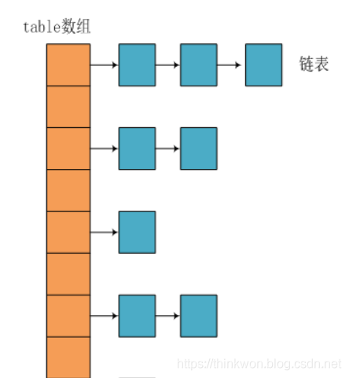
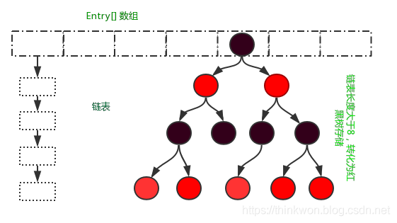
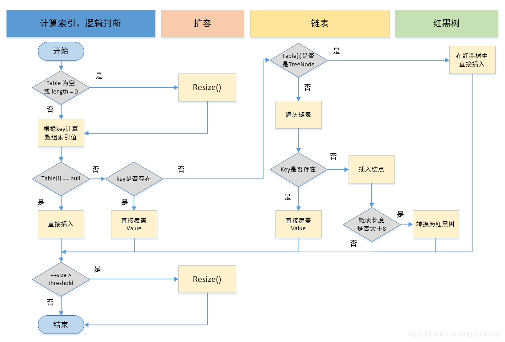
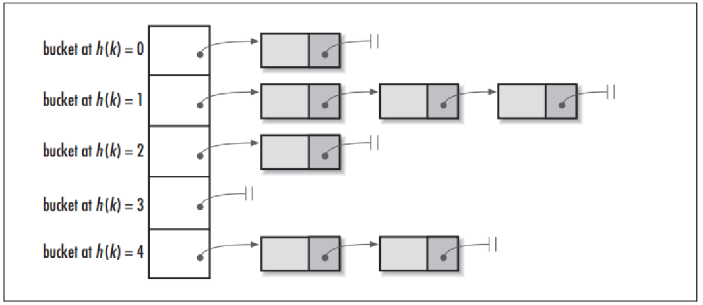
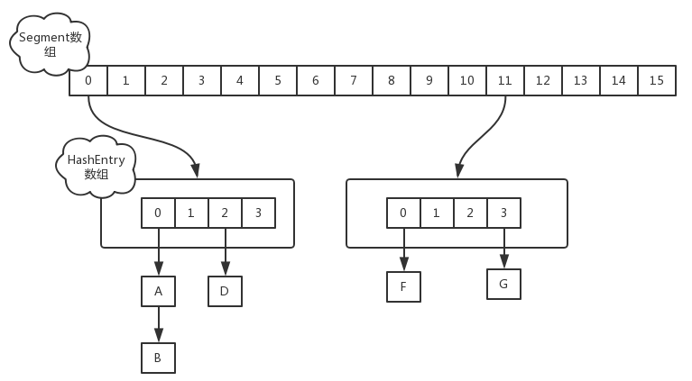
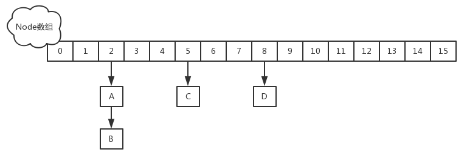
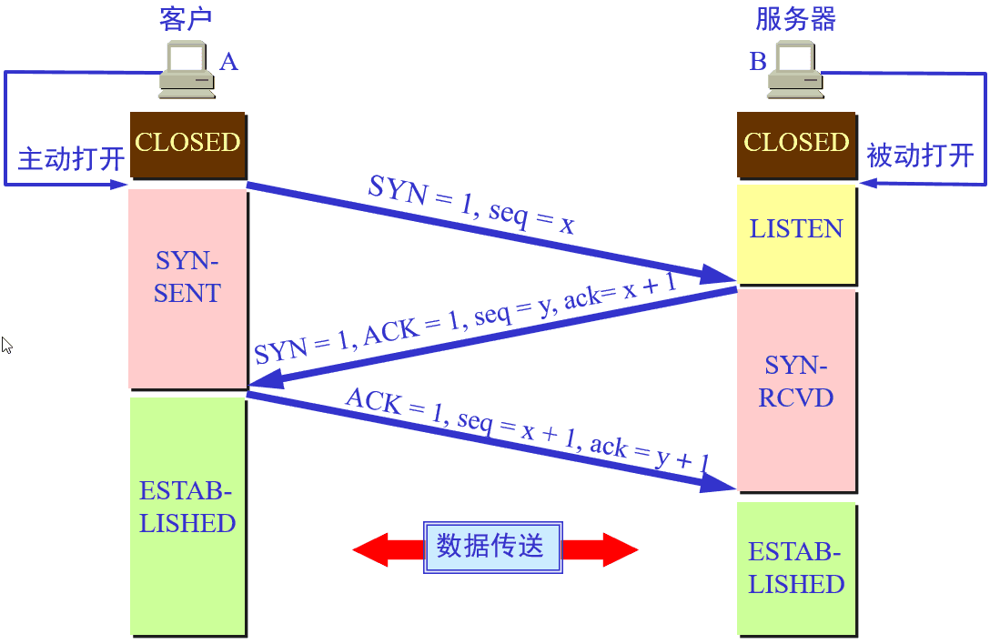

## 问题：

### 一、集合/容器

#### （一）概述

1. 什么是集合

2. 集合的特点

3. 集合和数组的区别

4. 使用集合框架的好处

5. 常用的集合类有哪些？

6. List，Set，Map三者的区别？List、Set、Map 是否继承自 Collection 接口？List、Map、Set 三个接口存取元素时，各有什么特点？

7. 哪些集合类是线程安全的？

8. Java集合的快速失败机制 “fail-fast”？

9. 怎么确保一个集合不能被修改？

   

#### （二）Collection接口

##### （1）List接口

1. 迭代器 Iterator 是什么？
2. Iterator 怎么使用？有什么特点？
3. 如何边遍历边移除 Collection 中的元素？
4. Iterator 和 ListIterator 有什么区别？
5. 遍历一个 List 有哪些不同的方式？每种方法的实现原理是什么？Java 中 List 遍历的最佳实践是什么？
6. 说一下 ArrayList 的优缺点
7. 如何实现数组和 List 之间的转换？
8. ArrayList 和 LinkedList 的区别是什么？
9. ArrayList 和 Vector 的区别是什么？
10. 插入数据时，ArrayList、LinkedList、Vector谁速度较快？阐述 ArrayList、Vector、LinkedList 的存储性能和特性？
11. 多线程场景下如何使用 ArrayList？
12. 为什么 ArrayList 的 elementData 加上 transient 修饰？
13. List 和 Set 的区别

##### （2）Set接口

1. 说一下 HashSet 的实现原理？
2. HashSet如何检查重复？HashSet是如何保证数据不可重复的？
3. HashSet与HashMap的区别

##### （3）Queue接口

1. BlockingQueue是什么？
2. 在 Queue 中 poll()和 remove()有什么区别？


#### （三）Map接口

1. 说一下 HashMap 的实现原理？
2. HashMap在JDK1.7和JDK1.8中有哪些不同？HashMap的底层实现
3. HashMap的put方法的具体流程？
4. HashMap的扩容操作是怎么实现的？
5. HashMap是怎么解决哈希冲突的？
6. 能否使用任何类作为 Map 的 key？
7. 为什么HashMap中String、Integer这样的包装类适合作为K？
8. 如果使用Object作为HashMap的Key，应该怎么办呢？
9. HashMap为什么不直接使用hashCode()处理后的哈希值直接作为table的下标？
10. HashMap 的长度为什么是2的幂次方
11. HashMap 与 HashTable 有什么区别？
12. 如何决定使用 HashMap 还是 TreeMap？
13. HashMap 和 ConcurrentHashMap 的区别 
14. ConcurrentHashMap 和 Hashtable 的区别？


#### （四）辅助工具类

1. Array 和 ArrayList 有何区别？
2. 如何实现 Array 和 List 之间的转换？
3. comparable 和 comparator的区别？
4. Collection 和 Collections 有什么区别？
5. TreeMap 和 TreeSet 在排序时如何比较元素？Collections 工具类中的 sort()方法如何比较元素？


### 二、泛型


### 三、异常

1. Error 和 Exception 区别是什么？
2. 运行时异常和一般异常(受检异常)区别是什么？
3. JVM 是如何处理异常的？
4. throw 和 throws 的区别是什么？
5. final、finally、finalize 有什么区别？
6. NoClassDefFoundError 和 ClassNotFoundException 区别？
7. try-catch-finally 中哪个部分可以省略？
8. try-catch-finally 中，如果 catch 中 return 了，finally 还会执行吗？
9. 类 ExampleA 继承 Exception，类 ExampleB 继承ExampleA。
10. 常见的 RuntimeException 有哪些？
11. Java常见异常有哪些？


### 四、IO流

1. Java 中 IO 流分为几种?
2. BIO,NIO,AIO 有什么区别?
3. Files的常用方法都有哪些？


### 五、注解

1. 谈谈你对Java中注解的理解
2. Java中的元注解有哪些？


### 六、反射

1. 什么是反射机制？
2. 反射机制优缺点
3. 反射机制的应用场景有哪些？
4. Java获取反射的三种方法

### 七、网络

1. 为什么TCP连接的时候是3次？2次不可以吗？

2. 为什么TCP连接的时候是3次，关闭的时候却是4次？

3. 为什么客户端发出第四次挥手的确认报文后要等2MSL的时间才能释放TCP连接？

4. 如果已经建立了连接，但是客户端突然出现故障了怎么办？

5. 什么是HTTP，HTTP 与 HTTPS 的区别

6. 常用HTTP状态码

7. GET和POST区别

8. 什么是对称加密与非对称加密

9. 什么是HTTP2

10. Session、Cookie和Token的主要区别

11. Servlet是线程安全的吗

12. Servlet接口中有哪些方法及Servlet生命周期探秘

13. 如果客户端禁止 cookie 能实现 session 还能用吗？

    

### 八、并发

#### （一）基础知识

##### （1）并发编程的优缺点

1. 为什么要使用并发编程（并发编程的优点）
2. 并发编程有什么缺点
3. 并发编程三要素是什么？在 Java 程序中怎么保证多线程的运行安全？
4. 并行和并发有什么区别？
5. 什么是多线程，多线程的优劣？

##### （2）线程和进程区别

1. 什么是线程和进程?
2. 进程与线程的区别
3. 什么是上下文切换?
4. 守护线程和用户线程有什么区别呢？
5. 如何在 Windows 和 Linux 上查找哪个线程cpu利用率最高？
6. 什么是线程死锁
7. 形成死锁的四个必要条件是什么
8. 如何避免线程死锁

##### （3）创建线程的四种方式

- 创建线程有哪几种方式？
- 说一下 runnable 和 callable 有什么区别？
- 线程的 run()和 start()有什么区别？
- 为什么我们调用 start() 方法时会执行 run() 方法，为什么我们不能直接调用 run() 方法？
- 什么是 Callable 和 Future?
- 什么是 FutureTask？

##### （4）线程的状态和基本操作

1. 说说线程的生命周期及五种基本状态？
2. Java 中用到的线程调度算法是什么？
3. 线程的调度策略？
4. 什么是线程调度器(Thread Scheduler)和时间分片(Time Slicing )？
5. 请说出与线程同步以及线程调度相关的方法。
6. sleep() 和 wait() 有什么区别？
7. 你是如何调用 wait() 方法的？使用 if 块还是循环？为什么？
8. 为什么线程通信的方法 wait(), notify()和 notifyAll()被定义在 Object 类里？
9. 为什么 wait(), notify()和 notifyAll()必须在同步方法或者同步块中被调用？
10. Thread 类中的 yield 方法有什么作用？
11. 为什么 Thread 类的 sleep()和 yield ()方法是静态的？
12. 线程的 sleep()方法和 yield()方法有什么区别？
13. 如何停止一个正在运行的线程？
14. Java 中 interrupted 和 isInterrupted 方法的区别？
15. 什么是阻塞式方法？
16. Java 中你怎样唤醒一个阻塞的线程？
17. notify() 和 notifyAll() 有什么区别？
18. 如何在两个线程间共享数据？
19. Java 如何实现多线程之间的通讯和协作？
20. 同步方法和同步块，哪个是更好的选择？
21. 什么是线程同步和线程互斥，有哪几种实现方式？
22. 在监视器(Monitor)内部，是如何做线程同步的？程序应该做哪种级别的同步？
23. 如果你提交任务时，线程池队列已满，这时会发生什么
24. 什么叫线程安全？servlet 是线程安全吗?
25. 在 Java 程序中怎么保证多线程的运行安全？
26. 你对线程优先级的理解是什么？
27. 线程类的构造方法、静态块是被哪个线程调用的
28. Java 中怎么获取一份线程 dump 文件？你如何在 Java 中获取线程堆栈？
29. 一个线程运行时发生异常会怎样？
30. Java 线程数过多会造成什么异常？

#### （二）并发理论

##### （1）Java内存模型

1. Java中垃圾回收有什么目的？什么时候进行垃圾回收？
2. 如果对象的引用被置为null，垃圾收集器是否会立即释放对象占用的内存？
3. finalize()方法什么时候被调用？析构函数(finalization)的目的是什么？

##### （2）重排序与数据依赖性

1. 为什么代码会重排序？

##### （3）as-if-serial规则和happens-before规则的区别


#### （三）并发关键字

##### （1）synchronized

1. synchronized 的作用？
2. 说说自己是怎么使用 synchronized 关键字，在项目中用到了吗
3. 说一下 synchronized 底层实现原理？
4. 什么是自旋
5. 多线程中 synchronized 锁升级的原理是什么？
6. 线程 B 怎么知道线程 A 修改了变量
7. 当一个线程进入一个对象的 synchronized 方法 A 之后，其它线程是否可进入此对象的 synchronized 方法 B？
8. synchronized、volatile、CAS 比较
9. synchronized 和 Lock 有什么区别？
10. synchronized 和 ReentrantLock 区别是什么？

##### （2）volatile

1. volatile 关键字的作用
2. Java 中能创建 volatile 数组吗？
3. volatile 变量和 atomic 变量有什么不同？
4. volatile 能使得一个非原子操作变成原子操作吗？
5. volatile 修饰符的有过什么实践？
6. synchronized 和 volatile 的区别是什么？

##### （3）final

1. 什么是不可变对象，它对写并发应用有什么帮助？

#### （四）Lock体系

##### （1）Lock简介与初识AQS

1. Java Concurrency API 中的 Lock 接口(Lock interface)是什么？对比同步它有什么优势？
2. 乐观锁和悲观锁的理解及如何实现，有哪些实现方式？
3. 什么是 CAS
4. CAS 的会产生什么问题？
5. 什么是死锁？
6. 产生死锁的条件是什么？怎么防止死锁？
7. 死锁与活锁的区别，死锁与饥饿的区别？
8. 多线程锁的升级原理是什么？

##### （2）AQS(AbstractQueuedSynchronizer)详解与源码分析

1. AQS 介绍
2. AQS 原理分析

##### （3）ReentrantLock(重入锁)实现原理与公平锁非公平锁区别

1. 什么是可重入锁（ReentrantLock）？

##### （4）读写锁ReentrantReadWriteLock源码分析

1. ReadWriteLock 是什么

##### （5）Condition源码分析与等待通知机制

##### （6）LockSupport详解


#### （五）并发容器

##### （1）并发容器之ConcurrentHashMap详解(JDK1.8版本)与源码分析

1. 什么是ConcurrentHashMap？
2. Java 中 ConcurrentHashMap 的并发度是什么？
3. 什么是并发容器的实现？
4. Java 中的同步集合与并发集合有什么区别？
5. SynchronizedMap 和 ConcurrentHashMap 有什么区别？

##### （2）并发容器之CopyOnWriteArrayList详解

1. CopyOnWriteArrayList 是什么，可以用于什么应用场景？有哪些优缺点？

##### （3）并发容器之ThreadLocal详解

1. ThreadLocal 是什么？有哪些使用场景？
2. 什么是线程局部变量？

##### （4）ThreadLocal内存泄漏分析与解决方案

1. ThreadLocal造成内存泄漏的原因？
2. ThreadLocal内存泄漏解决方案？

##### （5）并发容器之BlockingQueue详解

1. 什么是阻塞队列？阻塞队列的实现原理是什么？如何使用阻塞队列来实现生产者-消费者模型？

##### （6）并发容器之ConcurrentLinkedQueue详解与源码分析

##### （7）并发容器之ArrayBlockingQueue与LinkedBlockingQueue详解


#### （六）线程池

##### （1）Executors类创建四种常见线程池

1. 什么是线程池？有哪几种创建方式？
2. 线程池有什么优点？
3. 线程池都有哪些状态？
4. 什么是 Executor 框架？为什么使用 Executor 框架？
5. 在 Java 中 Executor 和 Executors 的区别？
6. 线程池中 submit() 和 execute() 方法有什么区别？
7. 什么是线程组，为什么在 Java 中不推荐使用？


##### （2）线程池之ThreadPoolExecutor详解

1. Executors和ThreaPoolExecutor创建线程池的区别
2. 你知道怎么创建线程池吗？
3. ThreadPoolExecutor构造函数重要参数分析
4. ThreadPoolExecutor饱和策略
5. 一个简单的线程池Demo:`Runnable`+`ThreadPoolExecutor`

##### （3）线程池之ScheduledThreadPoolExecutor详解

##### （4）FutureTask详解


#### （七）原子操作类

1. 什么是原子操作？在 Java Concurrency API 中有哪些原子类(atomic classes)？
2. 说一下 atomic 的原理？

#### （八）并发工具

##### （1）CountDownLatch与CyclicBarrier

1. 在 Java 中 CycliBarriar 和 CountdownLatch 有什么区别？

##### （2）Semaphore与Exchanger

1. Semaphore 有什么作用
2. 什么是线程间交换数据的工具Exchanger
3. 常用的并发工具类有哪些？


### 九、JVM

（一）JVM 的主要组成部分及其作用


## 参考答案：

### 一、集合/容器

#### （一）概述

> 1、什么是集合

集合框架：**用于存储数据的容器**。集合框架是为表示和操作集合而规定的一种统一的标准的体系结构。


任何集合框架都包含三大块内容：对外的接口、接口的实现和对集合运算的算法。

- **接口**：表示集合的抽象数据类型。接口允许我们操作集合时不必关注具体实现，从而达到“多态”。在面向对象编程语言中，接口通常用来形成规范。
- **实现**：集合接口的具体实现，是重用性很高的数据结构。
- **算法**：在一个实现了某个集合框架中的接口的对象身上完成某种有用的计算的方法，例如查找、排序等。这些算法通常是多态的，因为相同的方法可以在同一个接口被多个类实现时有不同的表现。事实上，算法是可复用的函数。
  它减少了程序设计的辛劳。


**设计集合的目的**：

1. 集合框架通过提供有用的数据结构和算法使你能集中注意力于你的程序的重要部分上，而不是为了让程序能正常运转而将注意力于低层设计上。
2. 通过这些在无关API之间的简易的互用性，使你免除了为改编对象或转换代码以便联合这些API而去写大量的代码。 它提高了程序速度和质量。


> 2、集合的特点

集合的特点主要有如下两点：

- 对象封装数据，对象多了也需要存储。集合用于存储对象。

- 对象的个数确定可以使用数组，对象的个数不确定的可以用集合。因为集合是可变长度的。


> 3、集合和数组的区别

- 数组是固定长度的；集合可变长度的。

- 数组可以存储基本数据类型，也可以存储引用数据类型；集合只能存储引用数据类型。

- 数组存储的元素必须是同一个数据类型；集合存储的对象可以是不同数据类型。

**数据结构**：就是容器中存储数据的方式。

对于集合容器，有很多种。因为每一个容器的自身特点不同，其实原理在于每个容器的内部数据结构不同。

集合容器在不断向上抽取过程中，出现了集合体系。在使用一个体系的**原则**： ==参阅顶层内容。建立底层对象。==


> 4、使用集合框架的好处

- 容量自增长；
- 提供了高性能的数据结构和算法，使编码更轻松，提高了程序速度和质量；
- 允许不同 API 之间的互操作，API之间可以来回传递集合；
- 可以方便地扩展或改写集合，提高代码复用性和可操作性。
- 通过使用JDK自带的集合类，可以降低代码维护和学习新API成本。


> 5、常用的集合类有哪些？

**Map接口和Collection接口是所有集合框架的父接口**

**Collection接口**的子接口包括：**Set**接口和List接口

- Set接口的实现类主要有：

  1、HashSet

  2、TreeSet

  3、LinkedHashSet等

- List接口的实现类主要有：

  1、ArrayList

  2、LinkedList

  3、Stack

  4、Vector等

**Map接口**的实现类主要有：

1. HashMap
2. TreeMap
3. Hashtable
4. ConcurrentHashMap
5. Properties


> 6、List，Set，Map三者的区别？List、Set、Map 是否继承自 Collection 接口？List、Map、Set 三个接口存取元素时，各有什么特点？

Java 容器分为 Collection 和 Map 两大类，Collection集合的子接口有Set、List、Queue三种子接口。

我们比较常用的是Set、List。Map接口不是collection的子接口。


**Collection集合**主要有List和Set两大接口

- List：一个有序（元素存入集合的顺序和取出的顺序一致）容器，元素可以重复，可以插入多个null元素，元素都有索引。常用的实现类有 ArrayList、LinkedList 和 Vector。
- Set：一个无序（存入和取出顺序有可能不一致）容器，不可以存储重复元素，只允许存入一个null元素，必须保证元素唯一性。Set 接口常用实现类是 HashSet、LinkedHashSet 以及 TreeSet。

**Map集合**

- Map没有继承于Collection接口，从Map集合中检索元素时，只要给出键对象，就会返回对应的值对象。

- Map是一个键值对集合，存储键、值和之间的映射。 Key无序，唯一；value 不要求有序，允许重复。

- Map 的常用实现类：HashMap、TreeMap、HashTable、LinkedHashMap、ConcurrentHashMap


> 7、集合框架底层数据结构

**List接口**：

- Arraylist： Object数组
- Vector： Object数组
- LinkedList： 双向循环链表

**Set接口**：

- HashSet（无序，唯一）：基于 HashMap 实现的，底层采用 HashMap 来保存元素
- LinkedHashSet： LinkedHashSet 继承与 HashSet，并且其内部是通过 LinkedHashMap 来实现的。有点类似于我们之前说的LinkedHashMap 其内部是基于 HashMap 实现一样，不过还是有一点点区别的。
- TreeSet（有序，唯一）： 红黑树(自平衡的排序二叉树。)

**Map接口**：

- HashMap： JDK1.8之前HashMap由**数组+链表**组成的，数组是HashMap的主体，链表则是主要为了解决哈希冲突而存在的（“拉链法”解决冲突）.JDK1.8以后在解决哈希冲突时有了较大的变化，当链表长度大于阈值（默认为8）时，将链表转化为红黑树，以减少搜索时间

- LinkedHashMap：LinkedHashMap 继承自 HashMap，所以它的底层仍然是基于**拉链式散列结构**即由数组和链表或红黑树组成。另外，LinkedHashMap 在上面结构的基础上，增加了一条双向链表，使得上面的结构可以保持键值对的插入顺序。同时通过对链表进行相应的操作，实现了访问顺序相关逻辑。

- HashTable： HashTable除了实现同步外跟HashMap没什么区别，在实际应用中很少用到

- TreeMap： 红黑树（自平衡的排序二叉树）

  

> 8、Java集合的快速失败机制 “fail-fast”？

是java集合的一种**错误检测机制**，当多个线程对集合进行结构上的改变的操作时，有可能会产生 fail-fast 机制。

- 例如：假设存在两个线程（线程1、线程2），线程1通过Iterator在遍历集合A中的元素，在某个时候线程2修改了集合A的结构（是结构上面的修改，而不是简单的修改集合元素的内容），那么这个时候程序就会抛出 ConcurrentModificationException 异常，从而产生fail-fast机制。
- 原因：迭代器在遍历时直接访问集合中的内容，并且在遍历过程中使用一个 **modCount** 变量。集合在被遍历期间如果内容发生变化，就会改变modCount的值。每当迭代器使用hashNext()/next()遍历下一个元素之前，都会检测modCount变量是否为expectedmodCount值，是的话就返回遍历；否则抛出异常，终止遍历。

**解决办法**：

1. 在遍历过程中，所有涉及到改变modCount值得地方全部加上synchronized。
2. 使用CopyOnWriteArrayList来替换ArrayList


> 9、怎么确保一个集合不能被修改？

可以使用 Collections. unmodifiableCollection(Collection c) 方法来创建一个只读集合，这样改变集合的任何操作都会抛出 Java. lang. UnsupportedOperationException 异常。

示例代码如下：

```Java
List<String> list = new ArrayList<>();
list. add("x");
Collection<String> clist = Collections. unmodifiableCollection(list);
clist. add("y"); // 运行时此行报错
System. out. println(list. size());
```


#### （二）Collection接口

##### （1）List接口

> 1、迭代器 Iterator 是什么？

- Iterator 接口提供遍历任何 Collection 接口的方法。
- 我们可以从一个 Collection 中使用迭代器方法来获取迭代器实例。
- 迭代器取代了 Java 集合框架中的 Enumeration，迭代器允许调用者在迭代过程中移除元素。


> 2、Iterator 怎么使用？有什么特点？

Iterator 使用代码如下：

```Java
List<String> list = new ArrayList<>();
Iterator<String> it = list. iterator();
while(it. hasNext()){
  String obj = it. next();
  System. out. println(obj);
}
```

Iterator 的特点是只能单向遍历，但是更加安全，因为它可以确保，在当前遍历的集合元素被更改的时候，就会抛出								             

ConcurrentModificationException 异常。


> 3、如何边遍历边移除 Collection 中的元素？

边遍历边修改 Collection 的唯一正确方式是使用 Iterator.remove() 方法，如下：

```java
Iterator<Integer> it = list.iterator();
while(it.hasNext()){
   *// do something*
   it.remove();
}
```

一种最常见的**错误**代码如下：

```java
for(Integer i : list){
   list.remove(i)
}
```

运行以上错误代码会报 **ConcurrentModificationException 异常**。

这是因为当使用 foreach(for(Integer i : list)) 语句时，会自动生成一个iterator 来遍历该 list，但同时该 list 正在被 Iterator.remove() 修

改。Java 一般不允许一个线程在遍历 Collection 时另一个线程修改它。


> 4、Iterator 和 ListIterator 有什么区别？

- Iterator 可以遍历 Set 和 List 集合，而 ListIterator 只能遍历 List。
- Iterator 只能单向遍历，而 ListIterator 可以双向遍历（向前/后遍历）。
- ListIterator 实现 Iterator 接口，然后添加了一些额外的功能，比如添加一个元素、替换一个元素、获取前面或后面元素的索引位置。


> 5、遍历一个 List 有哪些不同的方式？每种方法的实现原理是什么？Java 中 List 遍历的最佳实践是什么？

遍历方式有以下几种：

1. for 循环遍历，基于计数器。在集合外部维护一个计数器，然后依次读取每一个位置的元素，当读取到最后一个元素后停止。
2. 迭代器遍历，Iterator。Iterator 是面向对象的一个设计模式，目的是屏蔽不同数据集合的特点，统一遍历集合的接口。Java 在 Collections 中支持了 Iterator 模式。
3. foreach 循环遍历。foreach 内部也是采用了 Iterator 的方式实现，使用时不需要显式声明 Iterator 或计数器。优点是代码简洁，不易出错；缺点是只能做简单的遍历，不能在遍历过程中操作数据集合，例如删除、替换。

最佳实践：Java Collections 框架中提供了一个 RandomAccess 接口，用来标记 List 实现是否支持 Random Access。

- 如果一个数据集合实现了该接口，就意味着它支持 Random Access，按位置读取元素的平均时间复杂度为 O(1)，如ArrayList。
- 如果没有实现该接口，表示不支持 Random Access，如LinkedList。

推荐的做法就是，支持 Random Access 的列表可用 for 循环遍历，否则建议用 Iterator 或 foreach 遍历。


> 6、说一下 ArrayList 的优缺点

ArrayList的优点如下：

- ArrayList 底层以数组实现，是一种随机访问模式。ArrayList 实现了 RandomAccess 接口，因此查找的时候非常快。
- ArrayList 在顺序添加一个元素的时候非常方便。

ArrayList 的缺点如下：

- 删除元素的时候，需要做一次元素复制操作。如果要复制的元素很多，那么就会比较耗费性能。
- 插入元素的时候，也需要做一次元素复制操作，缺点同上。

ArrayList 比较适合顺序添加、随机访问的场景。


> 7、如何实现数组和 List 之间的转换？

- 数组转 List：使用 Arrays. asList(array) 进行转换。
- List 转数组：使用 List 自带的 toArray() 方法。

代码示例：

```Java
// list to array
List<String> list = new ArrayList<String>();
list.add("123");
list.add("456");
list.toArray();

// array to list
String[] array = new String[]{"123","456"};
Arrays.asList(array);
```


> 8、ArrayList 和 LinkedList 的区别是什么？

- 数据结构实现：ArrayList 是动态数组的数据结构实现，而 LinkedList 是双向链表的数据结构实现。
- 随机访问效率：ArrayList 比 LinkedList 在随机访问的时候效率要高，因为 LinkedList 是线性的数据存储方式，所以需要移动指针从前往后依次查找。
- 增加和删除效率：在非首尾的增加和删除操作，LinkedList 要比 ArrayList 效率要高，因为 ArrayList 增删操作要影响数组内的其他数据的下标。
- 内存空间占用：LinkedList 比 ArrayList 更占内存，因为 LinkedList 的节点除了存储数据，还存储了两个引用，一个指向前一个元素，一个指向后一个元素。
- 线程安全：ArrayList 和 LinkedList 都是不同步的，也就是不保证线程安全；

综合来说，在需要频繁读取集合中的元素时，更推荐使用 ArrayList，而在插入和删除操作较多时，更推荐使用 LinkedList。

补充：数据结构基础之双向链表

双向链表也叫双链表，是链表的一种，它的每个数据结点中都有两个指针，分别指向直接后继和直接前驱。所以，从双向链表中的任意一个结点开始，都可以很方便地访问它的前驱结点和后继结点。


> 9、ArrayList 和 Vector 的区别是什么？

这两个类都实现了 List 接口（List 接口继承了 Collection 接口），他们都是有序集合

- 线程安全：Vector 使用了 Synchronized 来实现线程同步，是线程安全的，而 ArrayList 是非线程安全的。
- 性能：ArrayList 在性能方面要优于 Vector。
- 扩容：ArrayList 和 Vector 都会根据实际的需要动态的调整容量，只不过在 Vector 扩容每次会增加 1 倍，而 ArrayList 只会增加 50%。

Vector类的所有方法都是同步的。可以由两个线程安全地访问一个Vector对象、但是一个线程访问Vector的话代码要在同步操作上耗费大量的时间。

Arraylist不是同步的，所以在不需要保证线程安全时时建议使用Arraylist。


> 10、插入数据时，ArrayList、LinkedList、Vector谁速度较快？阐述 ArrayList、Vector、LinkedList 的存储性能和特性？

- ArrayList、Vector 底层的实现都是使用数组方式存储数据。数组元素数大于实际存储的数据以便增加和插入元素，它们都允许直接按序号索引元素，但是插入元素要涉及数组元素移动等内存操作，所以索引数据快而插入数据慢。
- Vector 中的方法由于加了 synchronized 修饰，因此 **Vector** **是线程安全容器，但性能上较ArrayList差**。
- LinkedList 使用双向链表实现存储，按序号索引数据需要进行前向或后向遍历，但插入数据时只需要记录当前项的前后项即可，所以 **LinkedList** **插入速度较快**。


> 11、多线程场景下如何使用 ArrayList？

ArrayList 不是线程安全的，如果遇到多线程场景，可以通过 Collections 的 synchronizedList 方法将其转换成线程安全的容器后再使

用。例如像下面这样：

```java
List<String> synchronizedList = Collections.synchronizedList(list);
synchronizedList.add("aaa");
synchronizedList.add("bbb");

for (int i = 0; i < synchronizedList.size(); i++) {
    System.out.println(synchronizedList.get(i));
}
```


> 12、为什么 ArrayList 的 elementData 加上 transient 修饰？

ArrayList 中的数组定义如下：

```java
private transient Object[] elementData;

```

再看一下 ArrayList 的定义：

```java
public class ArrayList<E> extends AbstractList<E>
     implements List<E>, RandomAccess, Cloneable, java.io.Serializable
    
```

可以看到 ArrayList 实现了 Serializable 接口，这意味着 ArrayList 支持序列化。transient 的作用是说不希望 elementData 数组被序列化，重写了 writeObject 实现：

```java
private void writeObject(java.io.ObjectOutputStream s) throws java.io.IOException{
    *// Write out element count, and any hidden stuff*
        int expectedModCount = modCount;
    s.defaultWriteObject();
    *// Write out array length*
        s.writeInt(elementData.length);
    *// Write out all elements in the proper order.*
        for (int i=0; i<size; i++)
            s.writeObject(elementData[i]);
    if (modCount != expectedModCount) {
        throw new ConcurrentModificationException();
}
```

每次序列化时，先调用 defaultWriteObject() 方法序列化 ArrayList 中的非 transient 元素，然后遍历 elementData，只序列化已存入的元素，这样既加快了序列化的速度，又减小了序列化之后的文件大小。


> 13、List 和 Set 的区别

- List , Set 都是继承自Collection 接口
- List 特点：一个有序（元素存入集合的顺序和取出的顺序一致）容器，元素可以重复，可以插入多个null元素，元素都有索引。常用的实现类有 ArrayList、LinkedList 和 Vector。
- Set 特点：一个无序（存入和取出顺序有可能不一致）容器，不可以存储重复元素，只允许存入一个null元素，必须保证元素唯一性。Set 接口常用实现类是 HashSet、LinkedHashSet 以及 TreeSet。
- 另外 List 支持for循环，也就是通过下标来遍历，也可以用迭代器，但是set只能用迭代，因为他无序，无法用下标来取得想要的值。
- Set：检索元素效率低下，删除和插入效率高，插入和删除不会引起元素位置改变。List：和数组类似，List可以动态增长，查找元素效率高，插入删除元素效率低，因为会引起其他元素位置改变


##### （2）Set接口

> 1、说一下 HashSet 的实现原理？

HashSet 是基于 HashMap 实现的，HashSet的值存放于HashMap的key上，HashMap的value统一为PRESENT，因此 HashSet 的实

现比较简单，相关 HashSet 的操作，基本上都是直接调用底层 HashMap 的相关方法来完成，HashSet 不允许重复的值。


> 2、HashSet如何检查重复？HashSet是如何保证数据不可重复的？

- 向HashSet 中add ()元素时，判断元素是否存在的依据，不仅要比较hash值，同时还要结合equles 方法比较。HashSet 中的add ()方法会使用HashMap 的put()方法。
- HashMap 的 key 是唯一的，由源码可以看出 HashSet 添加进去的值就是作为HashMap 的key，并且在HashMap中如果K/V相同时，会用新的V覆盖掉旧的V，然后返回旧的V。所以不会重复（ HashMap 比较key是否相等是先比较hashcode 再比较equals ）。

以下是HashSet 部分源码：

```java
private static final Object PRESENT = new Object();
private transient HashMap<E,Object> map;

public HashSet() {
    map = new HashMap<>();
}

public boolean add(E e) {
    // 调用HashMap的put方法,PRESENT是一个至始至终都相同的虚值
	return map.put(e, PRESENT)==null;
}
```

**hashCode（）与equals（）的相关规定**：

1. 如果两个对象相等，则hashcode一定也是相同的
2. 两个对象相等,对两个equals方法返回true
3. 两个对象有相同的hashcode值，它们也不一定是相等的
4. 综上，equals方法被覆盖过，则hashCode方法也必须被覆盖
5. hashCode()的默认行为是对堆上的对象产生独特值。如果没有重写hashCode()，则该class的两个对象无论如何都不会相等（即使这两个对象指向相同的数据）。

**==与equals的区别**

1. ==是判断两个变量或实例是不是指向同一个内存空间 equals是判断两个变量或实例所指向的内存空间的值是不是相同
2. ==是指对内存地址进行比较 equals()是对字符串的内容进行比较
3. ==指引用是否相同 equals()指的是值是否相同


> 3、HashSet与HashMap的区别

| HashMap                                                | HashSet                                                      |
| ------------------------------------------------------ | ------------------------------------------------------------ |
| 实现了Map接口                                          | 实现Set接口                                                  |
| 存储键值对                                             | 仅存储对象                                                   |
| 调用put（）向map中添加元素                             | 调用add（）方法向Set中添加元素                               |
| HashMap使用键（Key）计算Hashcode                       | HashSet使用成员对象来计算hashcode值，对于两个对象来说hashcode可能相同，所以equals()方法用来判断对象的相等性，如果两个对象不同的话，那么返回false |
| HashMap相对于HashSet较快，因为它是使用唯一的键获取对象 | HashSet较HashMap来说比较慢                                   |


##### （3）Queue

> 1、BlockingQueue是什么？

Java.util.concurrent.BlockingQueue是一个队列，在进行检索或移除一个元素的时候，它会等待队列变为非空；当在添加一个元素时，它会等待队列中的可用空间。

BlockingQueue接口是Java集合框架的一部分，主要用于**实现生产者-消费者模式**。我们不需要担心等待生产者有可用的空间，或消费者有可用的对象，因为它都在BlockingQueue的实现类中被处理了。Java提供了几种BlockingQueue的实现，比如ArrayBlockingQueue、LinkedBlockingQueue、PriorityBlockingQueue,、SynchronousQueue等。


> 2、在 Queue 中 poll()和 remove()有什么区别？

- 相同点：都是返回第一个元素，并在队列中删除返回的对象。
- 不同点：如果没有元素 poll()会返回 null，而 remove()会直接抛出 NoSuchElementException 异常。

代码示例：

```Java
Queue<String> queue = new LinkedList<String>();
queue. offer("string"); // add
System. out. println(queue. poll());
System. out. println(queue. remove());
System. out. println(queue. size());
```


#### （三）Map接口

> 1、说一下 HashMap 的实现原理？

HashMap概述： HashMap是基于哈希表的Map接口的非同步实现。此实现提供所有可选的映射操作，并允许使用null值和null键。此类不保证映射的顺序，特别是它不保证该顺序恒久不变。

HashMap的数据结构： 在Java编程语言中，最基本的结构就是两种，一个是数组，另外一个是模拟指针（引用），所有的数据结构都可以用这两个基本结构来构造的，HashMap也不例外。HashMap实际上是一个“链表散列”的数据结构，即数组和链表的结合体。

HashMap 基于 Hash 算法实现的

1. 当我们往HashMap中put元素时，利用key的hashCode重新hash，计算出当前对象的元素在数组中的下标

2. 存储时，如果出现hash值相同的key，此时有两种情况。

   (1)如果key相同，则覆盖原始值；

   (2)如果key不同（出现冲突），则将当前的key-value放入链表中

3. 获取时，直接找到hash值对应的下标，在进一步判断key是否相同，从而找到对应值。

4. 理解了以上过程就不难明白HashMap是如何解决hash冲突的问题，核心就是使用了数组的存储方式，然后将冲突的key的对象放入链表中，一旦发现冲突就在链表中做进一步的对比。

需要注意**Jdk 1.8中对HashMap的实现做了优化**： ==当链表中的节点数据超过八个之后，该链表会转为红黑树来提高查询效率，从原来的O(n)到O(logn)==


> 2、HashMap在JDK1.7和JDK1.8中有哪些不同？HashMap的底层实现

在Java中，保存数据有两种比较简单的数据结构：数组和链表。数组的特点是：寻址容易，插入和删除困难；链表的特点是：寻址困难，但插入和删除容易；所以我们将数组和链表结合在一起，发挥两者各自的优势，使用一种叫做**拉链法**的方式可以解决哈希冲突。

**（1）JDK1.8之前**

JDK1.8之前采用的是拉链法。**拉链法**：将链表和数组相结合。也就是说创建一个链表数组，数组中每一格就是一个链表。若遇到哈希冲突，则将冲突的值加到链表中即可。



**（2）JDK1.8之后**

相比于之前的版本，jdk1.8在解决哈希冲突时有了较大的变化，当链表长度大于阈值（默认为8）时，将链表转化为红黑树，以减少搜索时间。



**（3）JDK1.7 VS JDK1.8**  

JDK1.8主要解决或优化了一下问题：

1. resize 扩容优化
2. 引入了红黑树，目的是避免单条链表过长而影响查询效率，[红黑树算法]()
3. 解决了多线程死循环问题，但仍是非线程安全的，多线程时可能会造成数据丢失问题。

| 不同                     | JDK 1.7                                                      | JDK 1.8                                                      |
| ------------------------ | ------------------------------------------------------------ | ------------------------------------------------------------ |
| 存储结构                 | 数组 + 链表                                                  | 数组 + 链表 + 红黑树                                         |
| 初始化方式               | 单独函数：`inflateTable()`                                   | 直接集成到了扩容函数`resize()`中                             |
| hash值计算方式           | 扰动处理 = 9次扰动 = 4次位运算 + 5次异或运算                 | 扰动处理 = 2次扰动 = 1次位运算 + 1次异或运算                 |
| 存放数据的规则           | 无冲突时，存放数组；冲突时，存放链表                         | 无冲突时，存放数组；冲突 & 链表长度 < 8：存放单链表；冲突 & 链表长度 > 8：树化并存放红黑树 |
| 插入数据方式             | 头插法（先讲原位置的数据移到后1位，再插入数据到该位置）      | 尾插法（直接插入到链表尾部/红黑树）                          |
| 扩容后存储位置的计算方式 | 全部按照原来方法进行计算（即hashCode ->> 扰动函数 ->> (h&length-1)） | 按照扩容后的规律计算（即扩容后的位置=原位置 or 原位置 + 旧容量） |


> 3、HashMap的put方法的具体流程？

当我们put的时候，首先计算 `key`的`hash`值，这里调用了 `hash`方法，`hash`方法实际是让`key.hashCode()`与`key.hashCode()>>>16`进行异或操作，高16bit补0，一个数和0异或不变，所以 hash 函数大概的作用就是：**高16bit不变，低16bit和高16bit做了一个异或，目的是减少碰撞**。按照函数注释，因为bucket数组大小是2的幂，计算下标`index = (table.length - 1) & hash`，如果不做 hash 处理，相当于散列生效的只有几个低 bit 位，为了减少散列的碰撞，设计者综合考虑了速度、作用、质量之后，使用高16bit和低16bit异或来简单处理减少碰撞，而且JDK8中用了复杂度 O（logn）的树结构来提升碰撞下的性能。

putVal方法执行流程图



```java
public V put(K key, V value) {
    return putVal(hash(key), key, value, false, true);
}

static final int hash(Object key) {
    int h;
    return (key == null) ? 0 : (h = key.hashCode()) ^ (h >>> 16);
}

//实现Map.put和相关方法
final V putVal(int hash, K key, V value, boolean onlyIfAbsent,
                   boolean evict) {
    Node<K,V>[] tab; Node<K,V> p; int n, i;
    // 步骤①：tab为空则创建 
    // table未初始化或者长度为0，进行扩容
    if ((tab = table) == null || (n = tab.length) == 0)
        n = (tab = resize()).length;
    // 步骤②：计算index，并对null做处理  
    // (n - 1) & hash 确定元素存放在哪个桶中(相当于取余)，桶为空，新生成结点放入桶中(此时，这个结点是放在数组中)
    if ((p = tab[i = (n - 1) & hash]) == null)
        tab[i] = newNode(hash, key, value, null);
    // 桶中已经存在元素
    else {
        Node<K,V> e; K k;
        // 步骤③：节点key存在，直接覆盖value 
        // 比较桶中第一个元素(数组中的结点)的hash值相等，key相等
        if (p.hash == hash &&
            ((k = p.key) == key || (key != null && key.equals(k))))
                // 将第一个元素赋值给e，用e来记录
                e = p;
        // 步骤④：判断该链为红黑树 
        // hash值不相等，即key不相等；为红黑树结点
        // 如果当前元素类型为TreeNode，表示为红黑树，putTreeVal返回待存放的node, e可能为null
        else if (p instanceof TreeNode)
            // 放入树中
            e = ((TreeNode<K,V>)p).putTreeVal(this, tab, hash, key, value);
        // 步骤⑤：该链为链表 
        // 为链表结点
        else {
            // 在链表最末插入结点
            for (int binCount = 0; ; ++binCount) {
                // 到达链表的尾部
                
                //判断该链表尾部指针是不是空的
                if ((e = p.next) == null) {
                    // 在尾部插入新结点
                    p.next = newNode(hash, key, value, null);
                    //判断链表的长度是否达到转化红黑树的临界值，临界值为8
                    if (binCount >= TREEIFY_THRESHOLD - 1) // -1 for 1st
                        //链表结构转树形结构
                        treeifyBin(tab, hash);
                    // 跳出循环
                    break;
                }
                // 判断链表中结点的key值与插入的元素的key值是否相等
                if (e.hash == hash &&
                    ((k = e.key) == key || (key != null && key.equals(k))))
                    // 相等，跳出循环
                    break;
                // 用于遍历桶中的链表，与前面的e = p.next组合，可以遍历链表
                p = e;
            }
        }
        //判断当前的key已经存在的情况下，再来一个相同的hash值、key值时，返回新来的value这个值
        if (e != null) { 
            // 记录e的value
            V oldValue = e.value;
            // onlyIfAbsent为false或者旧值为null
            if (!onlyIfAbsent || oldValue == null)
                //用新值替换旧值
                e.value = value;
            // 访问后回调
            afterNodeAccess(e);
            // 返回旧值
            return oldValue;
        }
    }
    // 结构性修改
    ++modCount;
    // 步骤⑥：超过最大容量就扩容 
    // 实际大小大于阈值则扩容
    if (++size > threshold)
        resize();
    // 插入后回调
    afterNodeInsertion(evict);
    return null;
}

```

①.判断键值对数组table[i]是否为空或为null，否则执行resize()进行扩容；

②.根据键值key计算hash值得到插入的数组索引i，如果table[i]==null，直接新建节点添加，转向⑥，如果table[i]不为空，转向③；

③.判断table[i]的首个元素是否和key一样，如果相同直接覆盖value，否则转向④，这里的相同指的是hashCode以及equals；

④.判断table[i] 是否为treeNode，即table[i] 是否是红黑树，如果是红黑树，则直接在树中插入键值对，否则转向⑤；

⑤.遍历table[i]，判断链表长度是否大于8，大于8的话把链表转换为红黑树，在红黑树中执行插入操作，否则进行链表的插入操作；遍历过程中若发现key已经存在直接覆盖value即可；

⑥.插入成功后，判断实际存在的键值对数量size是否超多了最大容量threshold，如果超过，进行扩容。


> 4、HashMap的扩容操作是怎么实现的？

①.在jdk1.8中，resize()方法是在hashmap中的键值对大于阀值时或者初始化时，就调用resize()方法进行扩容；

②.每次扩展的时候，都是扩展2倍；

③.扩展后Node对象的位置要么在原位置，要么移动到原偏移量两倍的位置。

在putVal()中，我们看到在这个函数里面使用到了2次resize()方法，resize()方法表示的在进行第一次**初始化时**会对其进行扩容，或者当该**数组的实际大小大于其临界值值(第一次为12),**

这个时候在扩容的同时也会伴随的桶上面的元素进行重新分发，这也是JDK1.8版本的一个优化的地方，

- 在1.7中，扩容之后需要重新去计算其Hash值，根据Hash值对其进行分发
- 但在1.8版本中，则是根据在同一个桶的位置中进行判断(e.hash & oldCap)是否为0，重新进行hash分配后，该元素的位置要么停留在原始位置，要么移动到原始位置+增加的数组大小这个位置上

```java
final Node<K,V>[] resize() {
    Node<K,V>[] oldTab = table;//oldTab指向hash桶数组
    int oldCap = (oldTab == null) ? 0 : oldTab.length;
    int oldThr = threshold;
    int newCap, newThr = 0;
    if (oldCap > 0) {//如果oldCap不为空的话，就是hash桶数组不为空
        if (oldCap >= MAXIMUM_CAPACITY) {//如果大于最大容量了，就赋值为整数最大的阀值
            threshold = Integer.MAX_VALUE;
            return oldTab;//返回
        }//如果当前hash桶数组的长度在扩容后仍然小于最大容量 并且oldCap大于默认值16
        else if ((newCap = oldCap << 1) < MAXIMUM_CAPACITY &&
                 oldCap >= DEFAULT_INITIAL_CAPACITY)
            newThr = oldThr << 1; // double threshold 双倍扩容阀值threshold
    }
    // 旧的容量为0，但threshold大于零，代表有参构造有cap传入，threshold已经被初始化成最小2的n次幂
    // 直接将该值赋给新的容量
    else if (oldThr > 0) // initial capacity was placed in threshold
        newCap = oldThr;
    // 无参构造创建的map，给出默认容量和threshold 16, 16*0.75
    else {               // zero initial threshold signifies using defaults
        newCap = DEFAULT_INITIAL_CAPACITY;
        newThr = (int)(DEFAULT_LOAD_FACTOR * DEFAULT_INITIAL_CAPACITY);
    }
    // 新的threshold = 新的cap * 0.75
    if (newThr == 0) {
        float ft = (float)newCap * loadFactor;
        newThr = (newCap < MAXIMUM_CAPACITY && ft < (float)MAXIMUM_CAPACITY ?
                  (int)ft : Integer.MAX_VALUE);
    }
    threshold = newThr;
    // 计算出新的数组长度后赋给当前成员变量table
    @SuppressWarnings({"rawtypes","unchecked"})
        Node<K,V>[] newTab = (Node<K,V>[])new Node[newCap];//新建hash桶数组
    table = newTab;//将新数组的值复制给旧的hash桶数组
    // 如果原先的数组没有初始化，那么resize的初始化工作到此结束，否则进入扩容元素重排逻辑，使其均匀的分散
    if (oldTab != null) {
        // 遍历新数组的所有桶下标
        for (int j = 0; j < oldCap; ++j) {
            Node<K,V> e;
            if ((e = oldTab[j]) != null) {
                // 旧数组的桶下标赋给临时变量e，并且解除旧数组中的引用，否则就数组无法被GC回收
                oldTab[j] = null;
                // 如果e.next==null，代表桶中就一个元素，不存在链表或者红黑树
                if (e.next == null)
                    // 用同样的hash映射算法把该元素加入新的数组
                    newTab[e.hash & (newCap - 1)] = e;
                // 如果e是TreeNode并且e.next!=null，那么处理树中元素的重排
                else if (e instanceof TreeNode)
                    ((TreeNode<K,V>)e).split(this, newTab, j, oldCap);
                // e是链表的头并且e.next!=null，那么处理链表中元素重排
                else { // preserve order
                    // loHead,loTail 代表扩容后不用变换下标，见注1
                    Node<K,V> loHead = null, loTail = null;
                    // hiHead,hiTail 代表扩容后变换下标，见注1
                    Node<K,V> hiHead = null, hiTail = null;
                    Node<K,V> next;
                    // 遍历链表
                    do {             
                        next = e.next;
                        if ((e.hash & oldCap) == 0) {
                            if (loTail == null)
                                // 初始化head指向链表当前元素e，e不一定是链表的第一个元素，初始化后loHead
                                // 代表下标保持不变的链表的头元素
                                loHead = e;
                            else                                
                                // loTail.next指向当前e
                                loTail.next = e;
                            // loTail指向当前的元素e
                            // 初始化后，loTail和loHead指向相同的内存，所以当loTail.next指向下一个元素时，
                            // 底层数组中的元素的next引用也相应发生变化，造成lowHead.next.next.....
                            // 跟随loTail同步，使得lowHead可以链接到所有属于该链表的元素。
                            loTail = e;                           
                        }
                        else {
                            if (hiTail == null)
                                // 初始化head指向链表当前元素e, 初始化后hiHead代表下标更改的链表头元素
                                hiHead = e;
                            else
                                hiTail.next = e;
                            hiTail = e;
                        }
                    } while ((e = next) != null);
                    // 遍历结束, 将tail指向null，并把链表头放入新数组的相应下标，形成新的映射。
                    if (loTail != null) {
                        loTail.next = null;
                        newTab[j] = loHead;
                    }
                    if (hiTail != null) {
                        hiTail.next = null;
                        newTab[j + oldCap] = hiHead;
                    }
                }
            }
        }
    }
    return newTab;
}
```


> 5、HashMap是怎么解决哈希冲突的？

在解决这个问题之前，我们首先需要知道**什么是哈希冲突**，而在了解哈希冲突之前我们还要知道**什么是哈希**才行；

**（1）什么是哈希？**

Hash，一般翻译为“散列”，也有直接音译为“哈希”的，这就是把任意长度的输入通过散列算法，变换成固定长度的输出，该输出就是散列值（哈希值）；这种转换是一种压缩映射，也就是，散列值的空间通常远小于输入的空间，不同的输入可能会散列成相同的输出，所以不可能从散列值来唯一的确定输入值。**简单的说就是一种将任意长度的消息压缩到某一固定长度的消息摘要的函数**。

所有散列函数都有如下一个基本特性：**一定不同根据同一散列函数计算出的散列值如果不同，那么输入值肯定也不同；输入值不同，根据同一散列函数计算出的散列值可能相同**。


**（2）什么是哈希冲突？**

当两个不同的输入值，根据同一散列函数计算出相同的散列值的现象，我们就把它叫做碰撞（哈希碰撞）。


**（3）HashMap的数据结构**

HashMap使用一种叫做**链地址法**的方式可以解决哈希冲突：



这样我们就可以将拥有相同哈希值的对象组织成一个链表放在hash值所对应的bucket下， **但相比于hashCode返回的int类型，我们HashMap初始的容量大小`DEFAULT_INITIAL_CAPACITY = 1 << 4`（即2的四次方16）要远小于int类型的范围，所以我们如果只是单纯的用hashCode取余来获取对应的bucket这将会大大增加哈希碰撞的概率，并且最坏情况下还会将HashMap变成一个单链表，所以我们还需要对hashCode作一定的优化**


**（4）hash()函数**

上面提到的问题，主要是因为如果使用hashCode取余，那么相当于**参与运算的只有hashCode的低位**，高位是没有起到任何作用的，所以我们的思路就是让hashCode取值出的高位也参与运算，进一步降低hash碰撞的概率，使得数据分布更平均，我们把这样的操作称为**扰动**，在**JDK 1.8**中的hash()函数如下：

```java
static final int hash(Object key) {
    int h;
    return (key == null) ? 0 : (h = key.hashCode()) ^ (h >>> 16);// 与自己右移16位进行异或运算（高低位异或）
}
```

这比在**JDK 1.7**中，更为简洁，**相比在1.7中的4次位运算，5次异或运算（9次扰动），在1.8中，只进行了1次位运算和1次异或运算（2次扰动）**；


**（5）JDK1.8新增红黑树**


通过上面的**链地址法（使用散列表）**和**扰动函数**我们成功让我们的数据分布更平均，哈希碰撞减少，但是当我们的HashMap中存在大量数据时，加入我们某个bucket下对应的链表有n个元素，那么遍历时间复杂度就为O(n)，为了针对这个问题，JDK1.8在HashMap中新增了红黑树的数据结构，进一步使得遍历复杂度降低至O(logn)；


**（4）总结**

简单总结一下HashMap是使用了哪些方法来有效解决哈希冲突的：

1. 使用链地址法（使用散列表）来链接拥有相同hash值的数据；

2. 使用2次扰动函数（hash函数）来降低哈希冲突的概率，使得数据分布更平均；

3. 引入红黑树进一步降低遍历的时间复杂度，使得遍历更快；


> 6、能否使用任何类作为Map的 key？

**可以，** 然而在使用之前，需要考虑以下几点：

- 如果类重写了 equals() 方法，也应该重写 hashCode() 方法。
- 类的所有实例需要遵循与 equals() 和 hashCode() 相关的规则。
- 如果一个类没有使用 equals()，不应该在 hashCode() 中使用它。
- 用户自定义 Key 类最佳实践是使之为不可变的，这样 hashCode() 值可以被缓存起来，拥有更好的性能。不可变的类也可以确保 hashCode() 和 equals() 在未来不会改变，这样就会解决与可变相关的问题了。


> 7、为什么HashMap中String、Integer这样的包装类适合作为K？

String、Integer等包装类的特性能够保证Hash值的不可更改性和计算准确性，能够有效的减少Hash碰撞的几率

1. 都是final类型，即不可变性，保证key的不可更改性，不会存在获取hash值不同的情况
2. 内部已重写了`equals()`、`hashCode()`等方法，遵守了HashMap内部的规范，不容易出现Hash值计算错误的情况；


> 8、如果使用Object作为HashMap的Key，应该怎么办呢？

重写hashCode()和equals()方法

1. **重写hashCode()是因为需要计算存储数据的存储位置**，需要注意不要试图从散列码计算中排除掉一个对象的关键部分来提高性能，这样虽然能更快但可能会导致更多的Hash碰撞；
2. **重写equals()方法**，需要遵守自反性、对称性、传递性、一致性以及对于任何非null的引用值x，x.equals(null)必须返回false的这几个特性，**目的是为了保证key在哈希表中的唯一性**；


> 9、HashMap为什么不直接使用hashCode()处理后的哈希值直接作为table的下标？

- hashCode()方法返回的是int整数类型，其范围为-(2 ^ 31)~(2 ^ 31 - 1)，约有40亿个映射空间，
- 而HashMap的容量范围是在16（初始化默认值）~2 ^ 30，
- HashMap通常情况下是取不到最大值的，并且设备上也难以提供这么多的存储空间，
- 通过hashCode()计算出的哈希值可能不在数组大小范围内，进而无法匹配存储位置，因此不能直接作为下标


> 10、HashMap 的长度为什么是2的幂次方

为了能让 HashMap 存取高效，尽量较少碰撞，也就是要尽量把数据分配均匀，

每个链表/红黑树长度大致相同。这个实现就是把数据存到哪个链表/红黑树中的算法。


**这个算法应该如何设计呢？**

我们首先可能会想到采用%取余的操作来实现。但是，重点来了：“取余(%)操作中如果除数是2的幂次则等价于与其除数减一的与(&)操

作（也就是说 hash%length==hash&(length-1)的前提是 length 是2的 n 次方；）。” 并且 采用二进制位操作 &，相对于%能够提高运

算效率，这就解释了 HashMap 的长度为什么是2的幂次方。


**那为什么是两次扰动呢？**

这样就是加大哈希值低位的随机性，使得分布更均匀，从而提高对应数组存储下标位置的随机性&均匀性，最终减少Hash冲突，

两次就够了，已经达到了高位低位同时参与运算的目的；


> 11、HashMap 与 HashTable 有什么区别？

1. **线程安全**： HashMap 是非线程安全的，HashTable 是线程安全的；HashTable 内部的方法基本都经过 `synchronized` 修饰。HashTable已经不推荐使用（如果你要保证线程安全的话就使用 `ConcurrentHashMap `！）；
2. **效率**： 因为线程安全的问题，HashMap 要比 HashTable 效率高一点。另外，HashTable 基本被淘汰，不要在代码中使用它；
3. **对Null key 和Null value的支持**： HashMap 中，null 可以作为键，这样的键只有一个，可以有一个或多个键所对应的值为 null。但是在 HashTable 中 put 进的键值只要有一个 null，直接抛NullPointerException。
4.  **初始容量大小和每次扩充容量大小的不同**  ： ①创建时如果不指定容量初始值，Hashtable 默认的初始大小为11，之后每次扩充，容量变为原来的2n+1。HashMap 默认的初始化大小为16。之后每次扩充，容量变为原来的2倍。②创建时如果给定了容量初始值，那么 Hashtable 会直接使用你给定的大小，而 HashMap 会将其扩充为2的幂次方大小。也就是说 HashMap 总是使用2的幂作为哈希表的大小，后面会介绍到为什么是2的幂次方。
5. **底层数据结构**： JDK1.8 以后的 HashMap 在解决哈希冲突时有了较大的变化，当链表长度大于阈值（默认为8）时，将链表转化为红黑树，以减少搜索时间。Hashtable 没有这样的机制。
6. 推荐使用：在 Hashtable 的类注释可以看到，Hashtable 是保留类不建议使用，推荐在单线程环境下使用 HashMap 替代，如果需要多线程使用则用 ConcurrentHashMap 替代。


> 12、如何决定使用 HashMap 还是 TreeMap？

- 对于在Map中插入、删除和定位元素这类操作，HashMap是最好的选择。
- 然而，假如你需要对一个有序的key集合进行遍历，TreeMap是更好的选择。
- 基于你的collection的大小，也许向HashMap中添加元素会更快，将map换为TreeMap进行有序key的遍历。


> 13、HashMap 和 ConcurrentHashMap 的区别

- ConcurrentHashMap对整个桶数组进行了分割分段(Segment)，然后在每一个分段上都用lock锁进行保护，

  相对于HashTable的synchronized锁的粒度更精细了一些，并发性能更好，

  而HashMap没有锁机制，不是线程安全的。（JDK1.8之后ConcurrentHashMap启用了一种全新的方式实现,利用**CAS算法**。）

- HashMap的键值对允许有null，但是ConCurrentHashMap都不允许。


> 14、 ConcurrentHashMap 和 Hashtable 的区别？

ConcurrentHashMap 结合了 HashMap 和 HashTable 二者的优势。HashMap 没有考虑同步，HashTable 考虑了同步的问题。但是 

HashTable 在每次同步执行时都要锁住整个结构。 ConcurrentHashMap 锁的方式是稍微细粒度的。


ConcurrentHashMap 和 Hashtable 的区别主要体现在实现线程安全的方式上不同。

- **底层数据结构**： JDK1.7的 ConcurrentHashMap 底层采用 **分段的数组+链表** 实现，JDK1.8 采用的数据结构跟HashMap1.8的结构一样，数组+链表/红黑二叉树。Hashtable 和 JDK1.8 之前的 HashMap 的底层数据结构类似都是采用 **数组+链表** 的形式，数组是 HashMap 的主体，链表则是主要为了解决哈希冲突而存在的；

- **实现线程安全的方式（重要）**： 

  ① **在JDK1.7的时候，ConcurrentHashMap（分段锁）** 对整个桶数组进行了分割分段(Segment)，每一把锁只锁容器其中一部分数据，多线程访问容器里不同数据段的数据，就不会存在锁竞争，提高并发访问率。（默认分配16个Segment，比Hashtable效率提高16倍。） **到了 JDK1.8 的时候已经摒弃了Segment的概念，而是直接用 Node 数组+链表+红黑树的数据结构来实现，并发控制使用 synchronized 和 CAS 来操作。（JDK1.6以后 对 synchronized锁做了很多优化）** 整个看起来就像是优化过且线程安全的 HashMap，虽然在JDK1.8中还能看到 Segment 的数据结构，但是已经简化了属性，只是为了兼容旧版本；

  ② **Hashtable(同一把锁)** :使用 synchronized 来保证线程安全，效率非常低下。当一个线程访问同步方法时，其他线程也访问同步方法，可能会进入阻塞或轮询状态，如使用 put 添加元素，另一个线程不能使用 put 添加元素，也不能使用 get，竞争会越来越激烈效率越低。

**两者的对比图**：

HashTable:


JDK1.7的ConcurrentHashMap：


JDK1.8的ConcurrentHashMap（TreeBin: 红黑二叉树节点 Node: 链表节点）：


> 15、ConcurrentHashMap 底层具体实现知道吗？实现原理是什么？

**JDK1.7**

首先将数据分为一段一段的存储，然后给每一段数据配一把锁，当一个线程占用锁访问其中一个段数据时，其他段的数据也能被其他线程访问。

在JDK1.7中，ConcurrentHashMap采用Segment + HashEntry的方式进行实现，结构如下：

- 一个 ConcurrentHashMap 里包含一个 Segment 数组。Segment 的结构和HashMap类似，是一种数组和链表结构，
- 一个 Segment 包含一个 HashEntry 数组，每个 HashEntry 是一个链表结构的元素，每个 Segment 守护着一个HashEntry数组里的元素，
- 当对 HashEntry 数组的数据进行修改时，必须首先获得对应的 Segment的锁。



1. 该类包含两个**静态内部类** HashEntry 和 Segment ；前者用来封装映射表的键值对，后者用来充当锁的角色；
2. Segment 是一种**可重入的锁** ReentrantLock，每个 Segment 守护一个HashEntry 数组里的元素，当对 HashEntry 数组的数据进行修改时，必须首先获得对应的 Segment 锁。


**JDK1.8**

在**JDK1.8中，放弃了Segment臃肿的设计，取而代之的是采用Node + CAS + Synchronized来保证并发安全进行实现**，synchronized只锁定当前链表或红黑二叉树的首节点，这样只要hash不冲突，就不会产生并发，效率又提升N倍。

结构如下：



**附加源码，有需要的可以看看**

插入元素过程（建议去看看源码）：

如果相应位置的Node还没有初始化，则调用CAS插入相应的数据；

```java
else if ((f = tabAt(tab, i = (n - 1) & hash)) == null) {
    if (casTabAt(tab, i, null, new Node<K,V>(hash, key, value, null)))
        break;                   // no lock when adding to empty bin
}
```

如果相应位置的Node不为空，且当前该节点不处于移动状态，则对该节点加synchronized锁，如果该节点的hash不小于0，则遍历链表更新节点或插入新节点；

```java
if (fh >= 0) {
    binCount = 1;
    for (Node<K,V> e = f;; ++binCount) {
        K ek;
        if (e.hash == hash &&
            ((ek = e.key) == key ||
             (ek != null && key.equals(ek)))) {
            oldVal = e.val;
            if (!onlyIfAbsent)
                e.val = value;
            break;
        }
        Node<K,V> pred = e;
        if ((e = e.next) == null) {
            pred.next = new Node<K,V>(hash, key, value, null);
            break;
        }
    }
}
```

1. 如果该节点是TreeBin类型的节点，说明是红黑树结构，则通过putTreeVal方法往红黑树中插入节点；如果binCount不为0，说明put操作对数据产生了影响，如果当前链表的个数达到8个，则通过treeifyBin方法转化为红黑树，如果oldVal不为空，说明是一次更新操作，没有对元素个数产生影响，则直接返回旧值；
2. 如果插入的是一个新节点，则执行addCount()方法尝试更新元素个数baseCount；


#### （四）辅助工具类

> 1、Array 和 ArrayList 有何区别？

- Array 可以存储基本数据类型和对象，ArrayList 只能存储对象。
- Array 是指定固定大小的，而 ArrayList 大小是自动扩展的。
- Array 内置方法没有 ArrayList 多，比如 addAll、removeAll、iteration 等方法只有 ArrayList 有。

对于基本类型数据，集合使用自动装箱来减少编码工作量。但是，当处理固定大小的基本数据类型的时候，这种方式相对比较慢。


> 2、如何实现 Array 和 List 之间的转换？

- Array 转 List： Arrays. asList(array) ；
- List 转 Array：List 的 toArray() 方法。


> 3、comparable 和 comparator的区别？

- comparable接口实际上是出自java.lang包，它有一个 compareTo(Object obj)方法用来排序
- comparator接口实际上是出自 java.util 包，它有一个compare(Object obj1, Object obj2)方法用来排序

1. 一般我们需要对一个集合使用自定义排序时，我们就要重写compareTo方法或compare方法，

2. 当我们需要对某一个集合实现两种排序方式，

   比如一个song对象中的歌名和歌手名分别采用一种排序方法的话，我们可以

   ①重写compareTo方法和使用自制的Comparator方法

   ②以两个Comparator来实现歌名排序和歌星名排序

   第二种代表我们只能使用两个参数版的Collections.sort().


> 4、Collection 和 Collections 有什么区别？

- java.util.Collection 是一个集合接口（集合类的一个顶级接口）。它提供了对集合对象进行基本操作的通用接口方法。Collection接口在Java 类库中有很多具体的实现。Collection接口的意义是为各种具体的集合提供了最大化的统一操作方式，其直接继承接口有List与Set。
- Collections则是集合类的一个工具类/帮助类，其中提供了一系列静态方法，用于对集合中元素进行排序、搜索以及线程安全等各种操作。


> 5、TreeMap 和 TreeSet 在排序时如何比较元素？Collections 工具类中的 sort()方法如何比较元素？

1. TreeSet 要求存放的**对象**所属的类必须实现 **Comparable 接口**，该接口提供了比较元素的 compareTo()方法，当插入元素时会回调该方法比较元素的大小。
2. TreeMap 要求存放的键值对映射的**键**必须实现 **Comparable 接口**从而根据键对元素进行排序。


Collections 工具类的 sort 方法有两种重载的形式，

- 第一种：要求传入的待排序容器中存放的**对象**比较实现 **Comparable 接口**以实现元素的比较；
- 第二种：不强制性的要求容器中的元素必须可比较，但是要求传入第二个参数，**参数是Comparator 接口的子类型**（需要重写 compare 方法实现元素的比较），相当于一个临时定义的排序规则，其实就是通过 ==接口注入== 比较元素大小的算法，也是对 ==回调模式== 的应用（Java 中对函数式编程的支持）。


### 二、泛型


### 三、异常

> 1、Error 和 Exception 区别是什么？

1. Error 类型的错误通常为虚拟机相关错误，如系统崩溃，内存不足，堆栈溢出等，编译器不会对这类错误进行检测，JAVA 应用程序也不应对这类错误进行捕获，一旦这类错误发生，通常应用程序会被终止，仅靠应用程序本身无法恢复；
2. Exception 类的错误是可以在应用程序中进行捕获并处理的，通常遇到这种错误，应对其进行处理，使应用程序可以继续正常运行。


> 2、运行时异常和一般异常(受检异常)区别是什么？

运行时异常包括 RuntimeException 类及其子类，表示 JVM 在运行期间可能出现的异常。 Java 编译器不会检查运行时异常。

受检异常是Exception 中除 RuntimeException 及其子类之外的异常。 Java 编译器会检查受检异常。

**RuntimeException异常和受检异常之间的区别**：

- 是否强制要求调用者必须处理此异常，如果强制要求调用者必须进行处理，那么就使用受检异常，
- 否则就选择非受检异常(RuntimeException)。一般来讲，如果没有特殊的要求，我们建议使用RuntimeException异常。


> 3、JVM 是如何处理异常的？

1. 在一个方法中如果发生异常，这个方法会创建一个异常对象，并转交给 JVM，该异常对象包含异常名称，异常描述以及异常发生时应用程序的状态。创建异常对象并转交给 JVM 的过程称为**抛出异常**。可能有一系列的方法调用，最终才进入抛出异常的方法，这一系列方法调用的有序列表叫做调用栈。
2. JVM 会顺着调用栈去查找看是否有可以处理异常的代码，如果有，则调用异常处理代码。当 JVM 发现可以处理异常的代码时，会把发生的异常传递给它。如果 JVM 没有找到可以处理该异常的代码块，JVM 就会将该异常转交给默认的异常处理器（默认处理器为 JVM 的一部分），默认异常处理器打印出异常信息并终止应用程序。


> 4、throw 和 throws 的区别是什么？

Java 中的异常处理除了包括捕获异常和处理异常之外，还包括声明异常和拋出异常，可以通过 throws 关键字在方法上声明该方法要拋

出的异常，或者在方法内部通过 throw 拋出异常对象。

**throws 关键字和 throw 关键字在使用上的几点区别如下**：

- throw 关键字用在方法内部，只能用于抛出一种异常，用来抛出方法或代码块中的异常，受查异常和非受查异常都可以被抛出。
- throws 关键字用在方法声明上，可以抛出多个异常，用来标识该方法可能抛出的异常列表。一个方法用 throws 标识了可能抛出的异常列表，调用该方法的方法中必须包含可处理异常的代码，否则也要在方法签名中用 throws 关键字声明相应的异常。


> 5、final、finally、finalize 有什么区别？

- final可以修饰类、变量、方法，修饰类表示该类不能被继承、修饰方法表示该方法不能被重写、修饰变量表示该变量是一个常量不能被重新赋值。
- finally一般作用在try-catch代码块中，在处理异常的时候，通常我们将一定要执行的代码方法finally代码块中，表示不管是否出现异常，该代码块都会执行，一般用来存放一些关闭资源的代码。
- finalize是一个方法，属于Object类的一个方法，而Object类是所有类的父类，Java 中允许使用 finalize()方法在垃圾收集器将对象从内存中清除出去之前做必要的清理工作。


> 6、NoClassDefFoundError 和 ClassNotFoundException 区别？

- NoClassDefFoundError 是一个 Error 类型的异常，是由 JVM 引起的，不应该尝试捕获这个异常。

  1、引起该异常的原因是 JVM 或 ClassLoader 尝试加载某类时在内存中找不到该类的定义，

  2、该动作发生在运行期间，即编译时该类存在，但是在运行时却找不到了，可能是编译后被删除了等原因导致；

- ClassNotFoundException 是一个受查异常，需要显式地使用 try-catch 对其进行捕获和处理，或在方法签名中用 throws 关键字进行声明。

  1、当使用 Class.forName, ClassLoader.loadClass 或 ClassLoader.findSystemClass 动态加载类到内存的时候，通过传入的类路径参数没有找到该类，就会抛出该异常；

  2、另一种抛出该异常的可能原因是某个类已经由一个类加载器加载至内存中，另一个加载器又尝试去加载它。


> 7、try-catch-finally 中哪个部分可以省略？

catch 可以省略

**原因**

1. 更为严格的说法其实是：try只适合处理运行时异常，try+catch适合处理运行时异常+普通异常。也就是说，如果你只用try去处理普通异常却不加以catch处理，编译是通不过的，因为编译器硬性规定，普通异常如果选择捕获，则必须用catch显示声明以便进一步处理。而运行时异常在编译时没有如此规定，所以catch可以省略，你加上catch编译器也觉得无可厚非。
2. 理论上，编译器看任何代码都不顺眼，都觉得可能有潜在的问题，所以你即使对所有代码加上try，代码在运行期时也只不过是在正常运行的基础上加一层皮。但是你一旦对一段代码加上try，就等于显示地承诺编译器，对这段代码可能抛出的异常进行捕获而非向上抛出处理。如果是普通异常，编译器要求必须用catch捕获以便进一步处理；如果运行时异常，捕获然后丢弃并且+finally扫尾处理，或者加上catch捕获以便进一步处理。
3. 至于加上finally，则是在不管有没捕获异常，都要进行的“扫尾”处理。


> 8、try-catch-finally 中，如果 catch 中 return 了，finally 还会执行吗？

答：会执行，在 return 前执行。

**注意**：在 finally 中改变返回值的做法是不好的，因为如果存在 finally 代码块，**try中的 return 语句不会立马返回调用者**，而是

记录下返回值待 finally 代码块执行完毕之后再向调用者返回其值，然后如果在 finally 中修改了返回值，就会返回修改后的值。显然，

在 finally 中返回或者修改返回值会对程序造成很大的困扰，C#中直接用编译错误的方式来阻止程序员干这种龌龊的事情，Java 中也可

以通过提升编译器的语法检查级别来产生警告或错误。

**代码示例1：**

```java
public static int getInt() {
    int a = 10;
    try {
        System.out.println(a / 0);
        a = 20;
    } catch (ArithmeticException e) {
        a = 30;
        return a;
        /*
         * return a 在程序执行到这一步的时候，这里不是return a 而是 return 30；这个返回路径就形成了
         * 但是呢，它发现后面还有finally，所以继续执行finally的内容，a=40
         * 再次回到以前的路径,继续走return 30，形成返回路径之后，这里的a就不是a变量了，而是常量30
         */
    } finally {
        a = 40;
    }
	return a;
}
```

执行结果：30

**代码示例2：**

```java
public static int getInt() {
    int a = 10;
    try {
        System.out.println(a / 0);
        a = 20;
    } catch (ArithmeticException e) {
        a = 30;
        return a;
    } finally {
        a = 40;
        //如果这样，就又重新形成了一条返回路径，由于只能通过1个return返回，所以这里直接返回40
        return a; 
    }

}
```

执行结果：40


> 9、类 ExampleA 继承 Exception，类 ExampleB 继承ExampleA。

有如下代码片断：

```java
try {
	throw new ExampleB("b")
} catch（ExampleA e）{
	System.out.println("ExampleA");
} catch（Exception e）{
	System.out.println("Exception");
}
1234567
```

请问执行此段代码的输出是什么？

**答**：

输出：ExampleA。（根据里**氏代换原则**[能使用父类型的地方一定能使用子类型]，抓取 ExampleA 类型异常的 catch 块能够抓住 try 块中抛出的 ExampleB 类型的异常）

面试题 - 说出下面代码的运行结果。（此题的出处是《Java 编程思想》一书）

```java
class Annoyance extends Exception {
}
class Sneeze extends Annoyance {
}
class Human {
	public static void main(String[] args)
	throws Exception {
		try {
			try {
				throw new Sneeze();
			} catch ( Annoyance a ) {
				System.out.println("Caught Annoyance");
				throw a;
			}
		} catch ( Sneeze s ) {
			System.out.println("Caught Sneeze");
			return ;
		} finally {
			System.out.println("Hello World!");
		}
	}
}
```

结果

```java
Caught Annoyance
Caught Sneeze
Hello World!
```


> 10、常见的 RuntimeException 有哪些？

- ClassCastException(类转换异常)
- IndexOutOfBoundsException(数组越界)
- NullPointerException(空指针)
- ArrayStoreException(数据存储异常，操作数组时类型不一致)
- 还有IO操作的BufferOverflowException异常


> 11、Java常见异常有哪些？

- java.lang.**IllegalAccessError**：违法访问错误。当一个应用试图访问、修改某个类的域（Field）或者调用其方法，但是又违反域或方法的可见性声明，则抛出该异常。
- java.lang.**InstantiationError**：实例化错误。当一个应用试图通过Java的new操作符构造一个抽象类或者接口时抛出该异常.
- java.lang.**OutOfMemoryError**：内存不足错误。当可用内存不足以让Java虚拟机分配给一个对象时抛出该错误。
- java.lang.**StackOverflowError**：堆栈溢出错误。当一个应用递归调用的层次太深而导致堆栈溢出或者陷入死循环时抛出该错误。
- java.lang.**ClassCastException**：类造型异常。假设有类A和B（A不是B的父类或子类），O是A的实例，那么当强制将O构造为类B的实例时抛出该异常。该异常经常被称为强制类型转换异常。
- java.lang.**ClassNotFoundException**：找不到类异常。当应用试图根据字符串形式的类名构造类，而在遍历CLASSPAH之后找不到对应名称的class文件时，抛出该异常。
- java.lang.**ArithmeticException**：算术条件异常。譬如：整数除零等。
- java.lang.**ArrayIndexOutOfBoundsExceptio**n：数组索引越界异常。当对数组的索引值为负数或大于等于数组大小时抛出。
- java.lang.**IndexOutOfBoundsException**：索引越界异常。当访问某个序列的索引值小于0或大于等于序列大小时，抛出该异常。
- java.lang.**InstantiationException**：实例化异常。当试图通过newInstance()方法创建某个类的实例，而该类是一个抽象类或接口时，抛出该异常。
- java.lang.**NoSuchFieldException**：属性不存在异常。当访问某个类的不存在的属性时抛出该异常。
- java.lang.**NoSuchMethodException**：方法不存在异常。当访问某个类的不存在的方法时抛出该异常。
- java.lang.**NullPointerException**：空指针异常。当应用试图在要求使用对象的地方使用了null时，抛出该异常。譬如：调用null对象的实例方法、访问null对象的属性、计算null对象的长度、使用throw语句抛出null等等。
- java.lang.**NumberFormatException**：数字格式异常。当试图将一个String转换为指定的数字类型，而该字符串确不满足数字类型要求的格式时，抛出该异常。
- java.lang.**StringIndexOutOfBoundsException**：字符串索引越界异常。当使用索引值访问某个字符串中的字符，而该索引值小于0或大于等于序列大小时，抛出该异常。


### 四、IO流

> 1、Java 中 IO 流分为几种?

- 按照流的流向分，可以分为输入流和输出流；
- 按照操作单元划分，可以划分为字节流和字符流；
- 按照流的角色划分为节点流和处理流。
  Java IO流共涉及40多个类，这些类看上去很杂乱，但实际上很有规则，而且彼此之间存在非常紧密的联系， Java IO流的40多个类都是从如下4个抽象类基类中派生出来的。

- InputStream/Reader: 所有的输入流的基类，前者是字节输入流，后者是字符输入流。
- OutputStream/Writer: 所有输出流的基类，前者是字节输出流，后者是字符输出流。

按操作方式分类结构图：


按操作对象分类结构图：

​	


> 2、BIO,NIO,AIO 有什么区别?

**简答**

- BIO：Blocking IO 同步**阻塞式 IO**，就是我们平常使用的**传统 IO**，它的特点是模式简单使用方便，**并发处理能力低**。

- NIO：New IO 同步**非阻塞 IO**，是传统 IO 的升级，客户端和服务器端通过 Channel（通道）通讯，实现了**多路复用**。

- AIO：Asynchronous IO 是 NIO 的升级，也叫 NIO2，实现了**异步非堵塞 IO** ，异步 IO 的操作基于**事件和回调机制**。

  

**使用场景：**

- 对于低负载、低并发的应用程序，可以使用同步阻塞I/O来提升开发速率和更好的维护性；
- 对于高负载、高并发的（网络）应用，应使用 NIO 的非阻塞模式来开发


**详细回答**

- BIO (Blocking I/O): 同步阻塞I/O模式，数据的读取写入必须阻塞在一个线程内等待其完成。在活动连接数不是特别高（小于单机1000）的情况下，这种模型是比较不错的，可以让每一个连接专注于自己的 I/O 并且编程模型简单，也不用过多考虑系统的过载、限流等问题。线程池本身就是一个天然的漏斗，可以缓冲一些系统处理不了的连接或请求。但是，当面对十万甚至百万级连接的时候，传统的 BIO 模型是无能为力的。因此，我们需要一种更高效的 I/O 处理模型来应对更高的并发量。
- NIO (New I/O): NIO是一种同步非阻塞的I/O模型，在**Java 1.4** 中引入了NIO框架，对应 java.nio 包，提供了 **Channel , Selector，Buffer**等抽象。NIO中的N可以理解为Non-blocking，不单纯是New。它支持面向缓冲的，基于通道的I/O操作方法。 NIO提供了与传统BIO模型中的 Socket 和 ServerSocket 相对应的 SocketChannel 和 ServerSocketChannel 两种不同的套接字通道实现,两种通道都支持阻塞和非阻塞两种模式。阻塞模式使用就像传统中的支持一样，比较简单，但是性能和可靠性都不好；非阻塞模式正好与之相反。
- AIO (Asynchronous I/O): AIO 也就是 NIO 2。在 **Java 7** 中引入了 NIO 的改进版 NIO 2,它是异步非阻塞的IO模型。异步 IO 是**基于事件和回调机制**实现的，也就是应用操作之后会直接返回，不会堵塞在那里，当后台处理完成，操作系统会通知相应的线程进行后续的操作。AIO 是异步IO的缩写，虽然 NIO 在网络操作中，提供了非阻塞的方法，但是 NIO 的 IO 行为还是同步的。对于 NIO 来说，我们的业务线程是在 IO 操作准备好时，得到通知，接着就由这个线程自行进行 IO 操作，IO操作本身是同步的。查阅网上相关资料，我发现就目前来说 AIO 的应用还不是很广泛，Netty 之前也尝试使用过 AIO，不过又放弃了。


> 3、Files的常用方法都有哪些？

Files. exists()：检测文件路径是否存在。

Files. createFile()：创建文件。

Files. createDirectory()：创建文件夹。

Files. delete()：删除一个文件或目录。

Files. copy()：复制文件。

Files. move()：移动文件。

Files. size()：查看文件个数。

Files. read()：读取文件。

Files. write()：写入文件。


### 五、注解


### 六、反射

> 1、什么是反射机制？

JAVA反射机制是在运行状态中，对于任意一个类，都能够知道这个类的所有属性和方法；对于任意一个对象，都能够调用它的任意一个方法和属性；这种**动态获取的信息以及动态调用对象的方法的功能**称为java语言的反射机制。

静态编译和动态编译

**静态编译**：在编译时确定类型，绑定对象

**动态编译**：运行时确定类型，绑定对象


> 2、反射机制优缺点

优点： 运行期类型的判断，动态加载类，提高代码灵活度。

缺点： 性能瓶颈：反射相当于一系列解释操作，通知 JVM 要做的事情，性能比直接的java代码要慢很多。


> 3、反射机制的应用场景有哪些？

**反射是框架设计的灵魂。**

在我们平时的项目开发过程中，基本上很少会直接使用到反射机制，但这不能说明反射机制没有用，实际上有很多设计、开发都与反射机制有关，例如：

- 模块化的开发，通过反射去调用对应的字节码；
- 动态代理设计模式也采用了反射机制，
- 还有我们日常使用的 Spring／Hibernate 等框架也大量使用到了反射机制。


**举例：**

1、我们在使用JDBC连接数据库时使用Class.forName()通过反射加载数据库的驱动程序；

2、Spring框架也用到很多反射机制，最经典的就是xml的配置模式。

Spring 通过 XML 配置模式装载 Bean 的过程：

- 1）将程序内所有 XML 或 Properties 配置文件加载入内存中; 
- 2）Java类里面解析xml或properties里面的内容，得到对应实体类的字节码字符串以及相关的属性信息; 
- 3）使用反射机制，根据这个字符串获得某个类的Class实例; 
- 4）动态配置实例的属性


> 4、Java获取反射的三种方法

1.通过new对象实现反射机制 

2.通过路径实现反射机制 

3.通过类名实现反射机制

```JAVA
public class Student {
    private int id;
    String name;
    protected boolean sex;
    public float score;
}

public class Get {
    //获取反射机制三种方式
    public static void main(String[] args) throws ClassNotFoundException {
        //方式一(通过建立对象)
        Student stu = new Student();
        Class classobj1 = stu.getClass();
        System.out.println(classobj1.getName());
        //方式二（通过所在路径-相对路径）
        Class classobj2 = Class.forName("fanshe.Student");
        System.out.println(classobj2.getName());
        //方式三（通过类名）
        Class classobj3 = Student.class;
        System.out.println(classobj3.getName());
    }
}

```


### 七、网络

> 1、为什么TCP连接的时候是3次？2次不可以吗？

1. 因为需要考虑连接时丢包的问题，如果只握手2次，第二次握手时如果服务端发给客户端的确认报文段丢失，此时服务端已经准备好了收发数(可以理解服务端已经连接成功)据，而客户端一直没收到服务端的确认报文，所以客户端就不知道服务端是否已经准备好了(可以理解为客户端未连接成功)，这种情况下客户端不会给服务端发数据，也会忽略服务端发过来的数据。
2. 如果是三次握手，即便发生丢包也不会有问题，比如如果第三次握手客户端发的确认ack报文丢失，服务端在一段时间内没有收到确认ACK报文的话就会重新进行第二次握手，也就是服务端会重发SYN报文段，客户端收到重发的报文段后会再次给服务端发送确认ACK报文。


客户端：兄弟，在吗？

服务端：在的，老铁

客户端：回个消息磨磨唧唧，都等你半天了




- **第一次握手**：客户端要向服务端发起连接请求，首先客户端随机生成一个起始序列号ISN(比如是100)，那客户端向服务端发送的报文段包含SYN标志位(也就是SYN=1)，序列号seq=100。
- **第二次握手**：服务端收到客户端发过来的报文后，发现SYN=1，知道这是一个连接请求，于是将客户端的起始序列号100存起来，并且随机生成一个服务端的起始序列号(比如是300)。然后给客户端回复一段报文，回复报文包含SYN和ACK标志(也就是SYN=1,ACK=1)、序列号seq=300、确认号ack=101(客户端发过来的序列号+1)。
- **第三次握手**：客户端收到服务端的回复后发现ACK=1并且ack=101,于是知道服务端已经收到了序列号为100的那段报文；同时发现SYN=1，知道了服务端同意了这次连接，于是就将服务端的序列号300给存下来。然后客户端再回复一段报文给服务端，报文包含ACK标志位(ACK=1)、ack=301(服务端序列号+1)、seq=101(第一次握手时发送报文是占据一个序列号的，所以这次seq就从101开始，需要注意的是不携带数据的ACK报文是不占据序列号的，所以后面第一次正式发送数据时seq还是101)。当服务端收到报文后发现ACK=1并且ack=301，就知道客户端收到序列号为300的报文了，就这样客户端和服务端通过TCP建立了连接。


> 2、为什么TCP连接的时候是3次，关闭的时候却是4次？

因为只有在客户端和服务端都没有数据要发送的时候才能断开TCP。而客户端发出FIN报文时只能保证客户端没有数据发了，服务端还有没有数据发客户端是不知道的。而服务端收到客户端的FIN报文后只能先回复客户端一个确认报文来告诉客户端我服务端已经收到你的FIN报文了，但我服务端还有一些数据没发完，等这些数据发完了服务端才能给客户端发FIN报文(所以不能一次性将确认报文和FIN报文发给客户端，就是这里多出来了一次)。

客户端：我要准备溜了

服务端：收到，老铁。不过等一下，我还有点东西要发你

服务端：也不是啥重要的，算了，不发了，滚你

客户端：****

服务端断开连接....

2MSL后

客户端断开连接......


比如客户端初始化的序列号ISA=100，服务端初始化的序列号ISA=300。TCP连接成功后客户端总共发送了1000个字节的数据，服务端在客户端发FIN报文前总共回复了2000个字节的数据。

- **第一次挥手**：当客户端的数据都传输完成后，客户端向服务端发出连接释放报文(当然数据没发完时也可以发送连接释放报文并停止发送数据)，释放连接报文包含FIN标志位(FIN=1)、序列号seq=1101(100+1+1000，其中的1是建立连接时占的一个序列号)。需要注意的是客户端发出FIN报文段后只是不能发数据了，但是还可以正常收数据；另外FIN报文段即使不携带数据也要占据一个序列号。

- **第二次挥手**：服务端收到客户端发的FIN报文后给客户端回复确认报文，确认报文包含ACK标志位(ACK=1)、确认号ack=1102(客户端FIN报文序列号1101+1)、序列号seq=2300(300+2000)。此时服务端处于关闭等待状态，而不是立马给客户端发FIN报文，这个状态还要持续一段时间，因为服务端可能还有数据没发完。

- **第三次挥手**：服务端将最后数据(比如50个字节)发送完毕后就向客户端发出连接释放报文，报文包含FIN和ACK标志位(FIN=1,ACK=1)、确认号和第二次挥手一样ack=1102、序列号seq=2350(2300+50)。

- **第四次挥手**：客户端收到服务端发的FIN报文后，向服务端发出确认报文，确认报文包含ACK标志位(ACK=1)、确认号ack=2351、序列号seq=1102。注意客户端发出确认报文后不是立马释放TCP连接，而是要经过2MSL(最长报文段寿命的2倍时长)后才释放TCP连接。而服务端一旦收到客户端发出的确认报文就会立马释放TCP连接，所以服务端结束TCP连接的时间要比客户端早一些。

  

> 3、为什么客户端发出第四次挥手的确认报文后要等2MSL的时间才能释放TCP连接？

这里同样是要考虑丢包的问题，如果第四次挥手的报文丢失，服务端就收到确认ACK报文，这样服务端就会就会重发第三次挥手的报文。这样以来，客户端从发出第四次挥手的报文到再次收到第三次挥手的报文经历的最长时间就是2MSL，所以需要等这么长时间来确认服务端确实已经收到了。


> 4、如果已经建立了连接，但是客户端突然出现故障了怎么办？

TCP设有一个**保活计时器**，客户端如果出现故障，服务器不能一直等下去，白白浪费资源。服务器每收到一次客户端的请求后都会重新复位这个计时器，时间通常是设置为**2小时**，若两小时还没有收到客户端的任何数据，服务器就会发送一个探测报文段，以后**每隔75秒**钟发送一次。若一连发送**10个探测报文**仍然没反应，服务器就认为客户端出了故障，接着就关闭连接。


> 5、什么是HTTP，HTTP 与 HTTPS 的区别

HTTP 是一个在计算机世界里专门在两点之间传输文字、图片、音频、视频等**超文本数据的约定和规范**

| 区别     | HTTP                                                         | HTTPS                                                        |
| -------- | ------------------------------------------------------------ | ------------------------------------------------------------ |
| 协议     | 运行在 TCP 之上，明文传输，**客户端与服务器端都无法验证对方的身份** | 身披 SSL( Secure Socket Layer )外壳的 HTTP，运行于 SSL 上，SSL 运行于 TCP 之上， **是添加了加密和认证机制的 HTTP**。 |
| 端口     | 80                                                           | 443                                                          |
| 资源消耗 | 较少                                                         | 由于加解密处理，会消耗更多的 CPU 和内存资源                  |
| 开销     | 无需证书                                                     | 需要证书，而证书一般需要向认证机构购买                       |
| 加密机制 | 无                                                           | 共享密钥加密和公开密钥加密并用的混合加密机制                 |
| 安全性   | 弱                                                           | 由于加密机制，安全性强                                       |


> 6、常用HTTP状态码

HTTP状态码表示客户端HTTP请求的返回结果、标识服务器处理是否正常、表明请求出现的错误等。

**状态码的类别：**

| 类别 | 原因短语                                               |
| ---- | ------------------------------------------------------ |
| 1XX  | Informational（信息性状态码） 接受的请求正在处理       |
| 2XX  | Success（成功状态码） 请求正常处理完毕                 |
| 3XX  | Redirection（重定向状态码） 需要进行附加操作以完成请求 |
| 4XX  | Client Error（客户端错误状态码） 服务器无法处理请求    |
| 5XX  | Server Error（服务器错误状态码） 服务器处理请求出错    |

**常用HTTP状态码：**

| 2XX  | 成功（这系列表明请求被正常处理了）                     |
| ---- | ------------------------------------------------------ |
| 200  | OK，表示从客户端发来的请求在服务器端被正确处理         |
| 204  | No content，表示请求成功，但响应报文不含实体的主体部分 |
| 206  | Partial Content，进行范围请求成功                      |

| 3XX  | 重定向（表明浏览器要执行特殊处理）                           |
| ---- | ------------------------------------------------------------ |
| 301  | moved permanently，永久性重定向，表示资源已被分配了新的 URL  |
| 302  | found，临时性重定向，表示资源临时被分配了新的 URL            |
| 303  | see other，表示资源存在着另一个 URL，应使用 GET 方法获取资源（对于301/302/303响应，几乎所有浏览器都会删除报文主体并自动用GET重新请求） |
| 304  | not modified，表示服务器允许访问资源，但请求未满足条件的情况（与重定向无关） |
| 307  | temporary redirect，临时重定向，和302含义类似，但是期望客户端保持请求方法不变向新的地址发出请求 |

| 4XX  | 客户端错误                                                   |
| ---- | ------------------------------------------------------------ |
| 400  | bad request，请求报文存在语法错误                            |
| 401  | unauthorized，表示发送的请求需要有通过 HTTP 认证的认证信息   |
| 403  | forbidden，表示对请求资源的访问被服务器拒绝，可在实体主体部分返回原因描述 |
| 404  | not found，表示在服务器上没有找到请求的资源                  |

| 5XX  | 服务器错误                                                   |
| ---- | ------------------------------------------------------------ |
| 500  | internal sever error，表示服务器端在执行请求时发生了错误     |
| 501  | Not Implemented，表示服务器不支持当前请求所需要的某个功能    |
| 503  | service unavailable，表明服务器暂时处于超负载或正在停机维护，无法处理请求 |


> 7、GET和POST区别

1、说到GET和POST，就不得不提HTTP协议，因为浏览器和服务器的交互是通过HTTP协议执行的，而GET和POST也是HTTP协议中的			  两种方法。

2、HTTP全称为Hyper Text Transfer Protocol，中文翻译为超文本传输协议，目的是保证浏览器与服务器之间的通信。HTTP的工作方			 式是客户端与服务器之间的请求-应答协议。

3、HTTP协议中定义了浏览器和服务器进行交互的不同方法，基本方法有4种，分别是GET，POST，PUT，DELETE。这四种方法可以理         	          解为，对服务器资源的查，改，增，删。

- GET：从服务器上获取数据，也就是所谓的查，仅仅是获取服务器资源，不进行修改。
- POST：向服务器提交数据，这就涉及到了数据的更新，也就是更改服务器的数据。
- PUT：英文含义是放置，也就是向服务器新添加数据，就是所谓的增。
- DELETE：从字面意思也能看出，这种方式就是删除服务器数据的过程。


**GET和POST区别**

1. **Get是不安全的**，因为在传输过程，数据被放在请求的URL中；Post的所有操作对用户来说都是不可见的。 但是这种做法也不时绝对的，大部分人的做法也是按照上面的说法来的，但是也可以在get请求加上 request body，给 post请求带上 URL 参数。

2. Get请求提交的url中的数据**最多只能是2048字节**，这个限制是**浏览器或者服务器给添加的**，http协议并没有对url长度进行限制，目的是为了保证服务器和浏览器能够正常运行，防止有人恶意发送请求。POST请求则没有大小限制。

3. Get限制Form表单的数据集的值必须为ASCII字符；而POST支持整个ISO10646字符集。

4. Get执行效率却比POST方法好。Get是Form提交的默认方法。

5. GET产生一个TCP数据包；POST产生两个TCP数据包。

   对于GET方式的请求，浏览器会把http header和data一并发送出去，服务器响应200（返回数据）；

   而对于POST，浏览器先发送header，服务器响应100 continue，浏览器再发送data，服务器响应200 ok（返回数据）。


> 8、什么是对称加密与非对称加密

- 对称密钥加密是指加密和解密使用同一个密钥的方式，**这种方式存在的最大问题就是密钥发送问题，即如何安全地将密钥发给对方；**
- 而非对称加密是指使用一对非对称密钥，即公钥和私钥，公钥可以随意发布，但私钥只有自己知道。发送密文的一方使用对方的公钥进行加密处理，对方接收到加密信息后，使用自己的私钥进行解密。
- 由于非对称加密的方式不需要发送用来解密的私钥，所以可以保证安全性；但是和对称加密比起来，非常的慢


> 9、什么是HTTP2

- HTTP2 可以提高了网页的性能。
- 在 HTTP1 中浏览器限制了同一个域名下的请求数量（Chrome 下一般是六个），当在请求很多资源的时候，由于队头阻塞，此时当浏览器达到最大请求数量，剩余的资源只能等待当前的六个请求完成后才能发起请求。
- HTTP2 中引入了**多路复用**的技术，这个技术可以只通过一个 TCP 连接就可以传输所有的请求数据。多路复用可以**绕过浏览器限制同一个域名下的请求数量的问题**，进而提高了网页的性能。


> 10、Session、Cookie和Token的主要区别

HTTP协议本身是 ==无状态== 的。什么是无状态呢，==即服务器无法判断用户身份。==

**（1）什么是cookie**

- cookie是**由Web服务器保存在用户浏览器上的小文件（key-value格式）**，包含用户相关的信息。
- 客户端向服务器发起请求，如果服务器需要记录该用户状态，就使用response向客户端浏览器颁发一个Cookie。
- 客户端浏览器会把Cookie保存起来。当浏览器再请求该网站时，浏览器把请求的网址连同该Cookie一同提交给服务器。服务器检查该Cookie，以此来辨认用户身份。


**（2）什么是session**

- session是**依赖Cookie实现**的。session是服务器端对象
- session 是浏览器和服务器会话过程中，服务器分配的一块储存空间。服务器默认浏览器在cookie中设置 sessionid，浏览器在向服务器请求过程中传输 cookie 包含 sessionid ，服务器根据 sessionid 获取出会话中存储的信息，然后确定会话的身份信息。


**（3）cookie与session区别**

- 存储位置与安全性：cookie数据存放在客户端上，安全性较差，session数据放在服务器上，安全性相对更高；
- 存储空间：单个cookie保存的数据不能超过4K，很多浏览器都限制一个站点最多保存20个cookie，session无此限制
- 占用服务器资源：session一定时间内保存在服务器上，当访问增多，占用服务器性能，考虑到服务器性能方面，应当使用cookie。


**（4）什么是Token**

- Token的引入：Token是在客户端频繁向服务端请求数据，服务端频繁的去数据库查询用户名和密码并进行对比，判断用户名和密码正确与否，并作出相应提示，在这样的背景下，Token便应运而生。
- Token的定义：**Token是服务端生成的一串字符串**，以作客户端进行请求的一个**令牌**，当第一次登录后，服务器生成一个Token便将此Token返回给客户端，以后客户端只需带上这个Token前来请求数据即可，无需再次带上用户名和密码。
- 使用Token的目的：Token的目的是**为了减轻服务器的压力，减少频繁的查询数据库，使服务器更加健壮。**
- Token 是在服务端产生的。如果前端使用用户名/密码向服务端请求认证，服务端认证成功，那么在服务端会返回 Token 给前端。前端可以在每次请求的时候带上 Token 证明自己的合法地位


**（5）session与token区别**

- session机制存在服务器压力增大，CSRF跨站伪造请求攻击，扩展性不强等问题；
- session存储在服务器端，token存储在客户端
- token提供**认证和授权**功能，作为身份认证，**token安全性比session好**；
- session这种会话存储方式方式只适用于客户端代码和服务端代码运行在同一台服务器上，token适用于项目级的前后端分离（前后端代码运行在不同的服务器下）


> 11、Servlet是线程安全的吗

**Servlet不是线程安全的，多线程并发的读写会导致数据不同步的问题。**

- 解决的办法是尽量不要定义name属性，而是要把name变量分别定义在doGet()和doPost()方法内。

  虽然使用synchronized(name){}语句块可以解决问题，但是会造成线程的等待，不是很科学的办法。

- 注意：

  1、多线程的并发的读写Servlet类属性会导致数据不同步。

  2、但是如果只是并发地读取属性而不写入，则不存在数据不同步的问题。因此Servlet里的只读属性最好定义为final类型的。


> 12、Servlet接口中有哪些方法及Servlet生命周期探秘

在Java Web程序中，**Servlet**主要负责接收用户请求**HttpServletRequest**，在doGet()、doPost()中做相应的处理，并将回应HttpServletResponse反馈给用户。Servlet可以设置初始化参数，供Servlet内部使用。

Servlet接口定义了5个方法，其中**前三个方法与Servlet生命周期相关**：

- void **init**(ServletConfig config) throws ServletException

- void **service**(ServletRequest req, ServletResponse resp) throws ServletException, java.io.IOException

- void **destory**()

- java.lang.String **getServletInfo()**

- ServletConfig **getServletConfig()**

  

**生命周期：**

- **Web容器加载Servlet并将其实例化后，Servlet生命周期开始**，容器运行其**init()方法**进行Servlet的初始化；

- 请求到达时调用Servlet的**service()方法**，service()方法会根据需要调用与请求对应的**doGet或doPost**等方法；

- 当服务器关闭或项目被卸载时服务器会将Servlet实例销毁，此时会调用Servlet的**destroy()方法**。

- **init方法和destory方法只会执行一次，service方法客户端每次请求Servlet都会执行**。Servlet中有时会用到一些需要初始化与销毁的资源，因此可以把初始化资源的代码放入init方法中，销毁资源的代码放入destroy方法中，这样就不需要每次处理客户端的请求都要初始化与销毁资源。

  

> 13、如果客户端禁止 cookie 能实现 session 还能用吗？

**不能。**

- Cookie 与 Session，一般认为是两个独立的东西，Session采用的是在服务器端保持状态的方案，而Cookie采用的是在客户端保持状态的方案。
- 但为什么禁用Cookie就不能得到Session呢？因为Session是用Session ID来确定当前对话所对应的服务器Session，而Session ID是通过Cookie来传递的，禁用Cookie相当于失去了Session ID，也就得不到Session了。

假定用户关闭Cookie的情况下使用Session，其实现途径有以下几种：

1. 手动通过URL传值、隐藏表单传递Session ID。
2. 用文件、数据库等形式保存Session ID，在跨页过程中手动调用。


### 八、并发


### 九、JVM

 ######  
